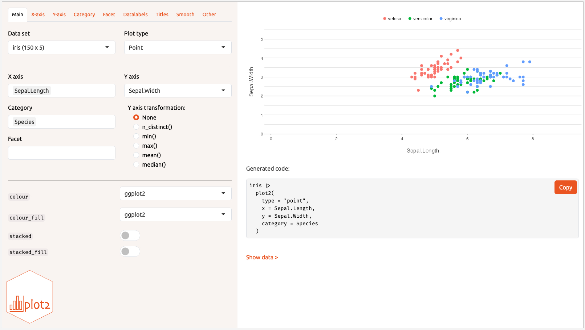

<!-- README.md is generated from README.Rmd; please edit that file. -->
<!-- Run with: suppressWarnings(rmarkdown::render("README.Rmd", quiet = TRUE)) -->

```{r, include = FALSE}
knitr::opts_chunk$set(
  collapse = TRUE,
  comment = "#>",
  fig.path = "man/figures/README-",
  out.width = "100%",
  dpi = 100
)
options(plot2.silent = FALSE)
```

# `plot2`: Simplified and Enhanced Data Visualisation in R

`plot2` is a simple yet powerful extension of `ggplot2`, designed to streamline the process of creating high-quality data visualisations in R by taking away most of the work. Built with the philosophy of **Less Typing, More Plotting**, `plot2` automates many of the routine tasks that typically require a lot of typing when plotting with `ggplot2`. It even renders pre-processing steps in, e.g., `dplyr`, `tidyr` and `forcats` largely superfluous. This package allows you to focus on the insights and stories your data can tell, rather than on the intricate details of plot construction.

Where `ggplot2` usage involves writing many different _functions_ (such as `ggplot()`, `aes()`, `geom_col()`, `facet_wrap()`, `theme()`, `scale_y_continuous()`, etc.), `plot2` usage only involves filling in required _arguments_ of a single function.

> For a **comprehensive guide to using `plot2`**, including advanced features and customisation options, please [see the full vignette here](https://msberends.github.io/plot2/articles/plot2.html).

## Key Features

- **Plotting With As Few Lines As Possible:** no need to type `ggplot()`, `aes()`, `geom_col()`, `facet_wrap()`, `theme()`, or `scale_y_continuous()` anymore, just one `plot2()` call will suffice.
- **Automatic Plot Selection:** `plot2` automatically chooses the best plot type based on your data, saving you time and effort.
- **In-line Data Transformations:** Eliminate the need for manual pre-processing steps e.g. in `dplyr` and `tidyr`, by performing data transformations directly within the plotting function, even for axis and plot titles.
- **Enhanced Sorting and Faceting:** Easily sort and facet your data with simple arguments, streamlining the creation of complex multi-panel plots.
- **New Clean Theme:** Includes `theme_minimal2()`, a new minimalist theme based on `theme_minimal()` that is further optimised for clear and professional outputs, therefore perfect for PDF publications, scientific manuscripts, and presentations.
- **Seamless Integration with ggplot2:** Retain all the power and flexibility of `ggplot2` while benefiting from `plot2`’s streamlined interface.

## Philosophy

`ggplot2` is a versatile tool that has become a cornerstone of data visualisation in R, giving users unparalleled control over their plots. However, with this flexibility often comes the need for repetitive and verbose code, especially for routine tasks such as setting axis labels, choosing plot types, or transforming data.

`plot2` is designed to complement `ggplot2` by offering a more streamlined and intuitive interface. It simplifies the process of creating plots by automatically handling many of the details, without sacrificing the flexibility and power that `ggplot2` provides. Whether you're quickly exploring data or preparing a polished visualisation for publication, `plot2` helps you get there faster with less code.

## Installation

You can install the latest version of `plot2` here:

```{r, eval = FALSE}
install.packages("plot2",
                 repos = c("https://cran.r-project.org",
                           "https://msberends.r-universe.dev"))

# OR:

remotes::install_github("msberends/plot2")
```

## Examples

> For **all supported plot types**, please [see our plot type overview here](https://msberends.github.io/plot2/articles/supported_types.html).

Here’s how easy it is to get started with `plot2`:

```{r}
library(plot2)

head(iris)

# no variables determined, so plot2() will try for itself -
# the type will be points since the first two variables are numeric
iris |>
  plot2()

# if x and y are set, no additional mapping will be set:
iris |> 
  plot2(Sepal.Width, Sepal.Length)
iris |> 
  plot2(Species, Sepal.Length)

# the arguments are in this order: x, y, category, facet
iris |> 
  plot2(Sepal.Length, Sepal.Width, Petal.Length, Species)

iris |> 
  plot2(Sepal.Length, Sepal.Width, Petal.Length, Species,
        colour = "viridis") # set the viridis colours
# set your own colours
iris |> 
  plot2(Sepal.Length, Sepal.Width, Petal.Length, Species,
        colour = c("white", "red", "black"))

# y can also be multiple (named) columns
iris |> 
  plot2(x = Sepal.Length,
        y = c(Length = Petal.Length, Width = Petal.Width),
        category.title = "Petal property")
iris |>
  # with included selection helpers such as where(), starts_with(), etc.:
  plot2(x = Species, y = where(is.double))
  
# the category type can be one or more aesthetics
iris |>
  plot2(zoom = TRUE,
        category.type = c("colour", "shape"),
        size = 3)
iris |>
  plot2(zoom = TRUE,
        category = Petal.Length,
        category.type = c("colour", "size"),
        colour = "viridis")

# easily add a smooth
iris |>
  plot2(zoom = TRUE,
        smooth = TRUE)
iris |>
  plot2(zoom = TRUE,
        smooth = TRUE,
        smooth.method = "lm")

# support for secondary y axis
mtcars |>
  plot2(x = mpg,
        y = hp,
        y_secondary = disp ^ 2, 
        y_secondary.scientific = TRUE,
        title = "Secondary y axis sets colour to the axis titles")


admitted_patients

# the arguments are in this order: x, y, category, facet
admitted_patients |>
  plot2(hospital, age)

admitted_patients |>
  plot2(hospital, age, gender)
  
admitted_patients |>
  plot2(hospital, age, gender, ward)
  
# or use any function for y
admitted_patients |>
  plot2(hospital, median(age), gender, ward)
admitted_patients |>
  plot2(hospital, n(), gender, ward)
admitted_patients |>
  plot2(x = hospital,
        y = age,
        category = gender,
        colour = c("F" = "#3F681C", "M" = "#375E97"),
        colour_fill = "#FFBB00",
        linewidth = 1.25,
        y.age = TRUE)

admitted_patients |>
  plot2(age, type = "hist")

# even titles support calculations, including support for {glue}
admitted_patients |>
  plot2(age, type = "hist",
        title = paste("Based on n =", n_distinct(patient_id), "patients"),
        subtitle = paste("Total rows:", n()),
        caption = glue::glue("From {n_distinct(hospital)} hospitals"),
        x.title = paste("Age ranging from", paste(range(age), collapse = " to ")))
 
# the default type is column, datalabels are automatically
# set in non-continuous types:
admitted_patients |> 
  plot2(hospital, n(), gender)
  
admitted_patients |> 
  plot2(hospital, n(), gender,
        stacked = TRUE)
        
admitted_patients |> 
  plot2(hospital, n(), gender,
        stacked_fill = TRUE)

# two categories might benefit from a dumbbell plot:
admitted_patients |> 
  plot2(hospital, median(age), gender, type = "dumbbell")
 
# sort on any direction:
admitted_patients |> 
  plot2(hospital, n(), gender,
        x.sort = "freq-asc",
        stacked = TRUE)

admitted_patients |> 
  plot2(hospital, n(), gender,
        x.sort = c("B", "D", "A"), # missing values ("C") will be added
        category.sort = "alpha-desc",
        stacked = TRUE)
        
# support for Sankey plots
Titanic |> # a table from base R
  plot2(x = c(Age, Class, Survived),
        category = Sex,
        type = "sankey")
# matrix support, such as for cor()
correlation_matrix <- cor(mtcars)
class(correlation_matrix)
head(correlation_matrix)
mtcars |> 
  cor() |>
  plot2()

mtcars |> 
  cor() |>
  plot2(colour = c("blue3", "white", "red3"),
        datalabels = TRUE,
        category.title = "*r*-value",
        title =  "Correlation matrix")


# plot2() supports all S3 extensions available through
# ggplot2::fortify() and broom::augment(), such as regression models:
lm(mpg ~ hp, data = mtcars) |> 
  plot2(x = mpg ^ -3,
        y = hp ^ 2,
        smooth = TRUE,
        smooth.method = "lm",
        smooth.formula = "y ~ log(x)",
        title = "Titles/captions *support* **markdown**",
        subtitle = "Axis titles contain the square notation: x^2")

# sf objects (geographic plots, 'simple features') are also supported
netherlands |> 
  plot2()
netherlands |> 
  plot2(colour_fill = "viridis", colour_opacity = 0.75) |>
  add_sf(netherlands, colour = "black", colour_fill = NA)
```

```{r, fig.showtext = TRUE}
# support for any system or Google font
mtcars |>
  plot2(mpg, hp,
        font = "Rock Salt",
        title = "This plot uses a Google Font")
```

Like `plot()`, just pass `x`, `y` in the way you prefer:

```{r, eval = FALSE}
plot2(mtcars, mpg, hp)

mtcars %>% plot2(mpg, hp)

plot2(hp ~ mpg, data = mtcars)

mtcars |> plot2(mpg, hp) # preferred method
```

## Shiny app

You can your plots interactively as well with the built-in Shiny app. All `plot2` arguments are available in it. In RStudio, there is an addin menu item too.

```{r, eval = FALSE}
iris |>
  create_interactively()
```



## Getting Involved

We welcome contributions to `plot2`, whether it's through reporting issues, suggesting features, or submitting pull requests. If you're familiar with `ggplot2` and the tidyverse, your insights will be especially valuable as we continue to develop and refine the package.

## Previous Iteration

Though only released here in August 2024, this package has had years of development with hundreds of Git commits in an earlier iteration [here](https://github.com/certe-medical-epidemiology/certeplot2).

## License

This project is licensed under the GNU GPL v2.0 License - see the [LICENSE](LICENSE.md) file for details.

