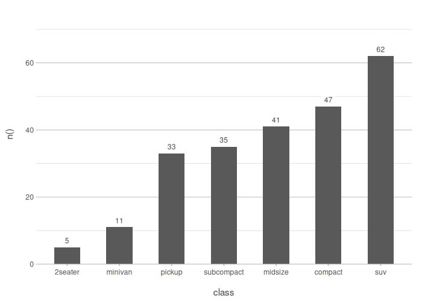
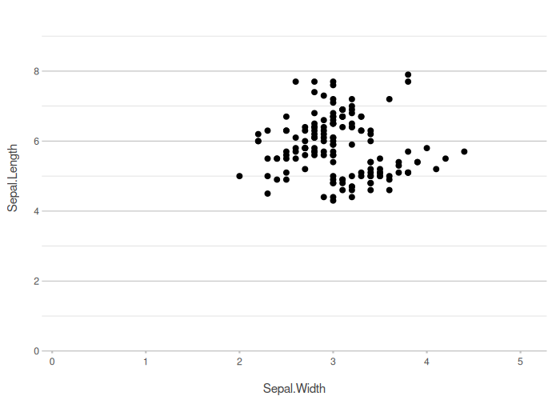
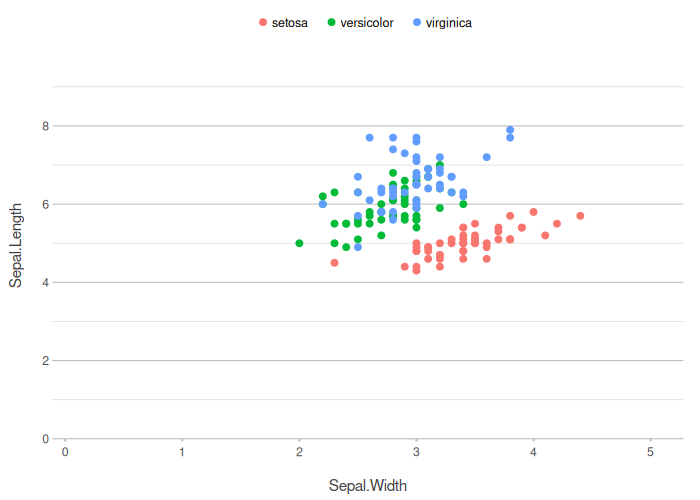
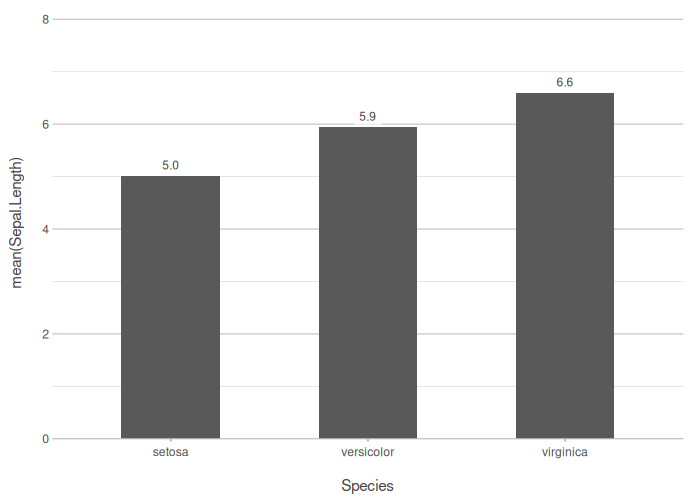
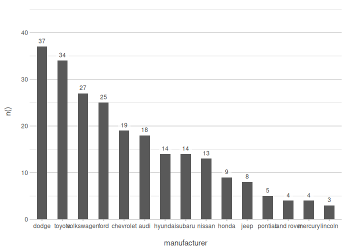
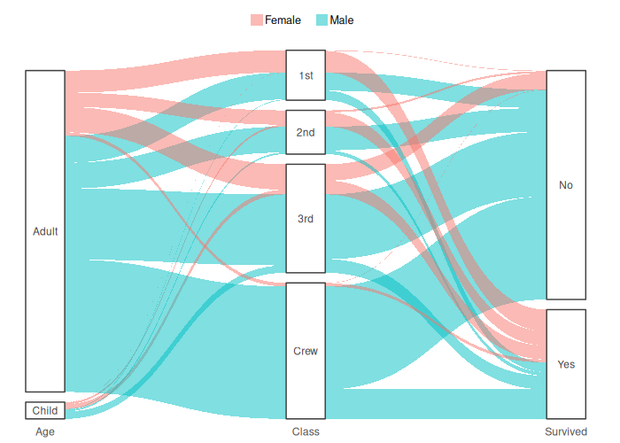
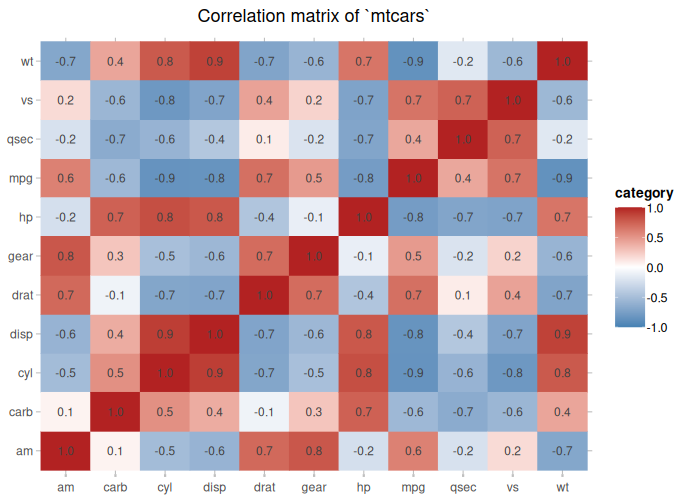

<!-- README.md is generated from README.Rmd; please edit that file. -->
<!-- Run with: suppressWarnings(rmarkdown::render("README.Rmd", quiet = TRUE)) -->

# `plot2`

**ggplot2, without the boilerplate.**

`plot2` is a single-function wrapper around `ggplot2` that handles the
routine work — grouping, aggregating, sorting, facetting, labelling — so
you do not have to. It returns a standard `ggplot` object, so every
`ggplot2` extension and layer works as usual.

Install from CRAN or r-universe:

``` r
install.packages("plot2", repos = c("https://cran.r-project.org",
                                    "https://msberends.r-universe.dev"))
```

------------------------------------------------------------------------

## The same chart, two ways

A sorted column chart of vehicle counts per class, with data labels. The
dataset `mpg` is bundled in `ggplot2`.

``` r
# ggplot2 + dplyr + forcats
library(ggplot2)
library(dplyr)
library(forcats)

mpg |>
  count(class) |>
  mutate(class = fct_reorder(class, n)) |>
  ggplot(aes(x = class, y = n)) +
  geom_col(width = 0.6) +
  geom_text(aes(label = n), vjust = -0.5, size = 3.5) +
  scale_y_continuous(expand = expansion(mult = c(0, 0.15))) +
  labs(x = "Vehicle class", y = "Count") +
  theme_minimal()
```

``` r
# plot2
library(plot2)

mpg |> plot2(x = class, y = n(), x.sort = "freq-asc")
```



Both produce the same chart. The difference is in how much you write.

------------------------------------------------------------------------

## What you stop writing

| Task                  | ggplot2                                                                                    | plot2                                    |
|-----------------------|--------------------------------------------------------------------------------------------|------------------------------------------|
| Aggregate then plot   | `group_by()` + `summarise()` + `ggplot()` + `geom_col()`                                   | `plot2(x = a, y = mean(b))`              |
| Sort bars             | `mutate(fct_reorder(...))`                                                                 | `x.sort = "freq-desc"`                   |
| Group by colour       | `aes(fill = var)` for bars, `aes(colour = var)` for points, each needing its own `scale_*` | `category = var`                         |
| Set a colour palette  | `scale_fill_manual(values = ...)` or `scale_colour_manual(values = ...)` depending on geom | `colour = c(...)` in all cases           |
| Facet                 | `+ facet_wrap(~var)`                                                                       | `facet = var`                            |
| Data labels           | `+ geom_text(aes(label = ...), vjust = ...)`                                               | automatic on discrete axes               |
| Stacked / filled bars | `geom_col(position = "stack")` + scale                                                     | `stacked = TRUE` / `stacked_fill = TRUE` |
| Clean axis expansion  | `scale_y_continuous(expand = expansion(...))`                                              | built-in default                         |

------------------------------------------------------------------------

## Examples

All examples below use datasets bundled in base R or `ggplot2`.

### The four arguments: x, y, category, facet

`plot2` is built around four named arguments. That is all you need for
most plots:

``` r
# x and y: plot2 picks the type. Two numerics → scatter.
iris |> plot2(x = Sepal.Width, y = Sepal.Length)
```



``` r
# category: colours the groups — works the same regardless of geom type.
# In ggplot2 you would use aes(fill = ...) for bars and aes(colour = ...) for
# points, each requiring its own scale_*. Here it is always category =.
iris |> plot2(x = Sepal.Width, y = Sepal.Length, category = Species)
```



``` r
# Categorical x → column with data labels. Inline aggregation in y.
iris |> plot2(x = Species, y = mean(Sepal.Length))
```



``` r
# facet: splits into panels. Fourth argument, same idea.
mpg |> plot2(x = class, y = mean(hwy), category = drv, facet = year)
```

### Sorting

``` r
mpg |> plot2(x = manufacturer, y = n(), x.sort = "freq-desc")
```



### Colour

`colour =` sets the palette for any plot type — no need to choose
between `scale_fill_*` and `scale_colour_*`:

``` r
iris |> plot2(x = Sepal.Width, y = Sepal.Length, category = Species,
              colour = "viridis")
iris |> plot2(x = Sepal.Width, y = Sepal.Length, category = Species,
              colour = c(setosa = "#3F681C", versicolor = "#375E97", virginica = "#FFBB00"))
```

When you need to distinguish the stroke from the fill (e.g. bars with a
coloured border), `colour` controls the stroke and `colour_fill`
controls the interior:

``` r
iris |> plot2(x = Species, y = mean(Sepal.Length),
              colour = "black",
              colour_fill = c(setosa = "#3F681C", versicolor = "#375E97", virginica = "#FFBB00"))
```

### Inline aggregations

Any summarising function works directly in the `y` argument — no
`group_by()` or `summarise()` needed:

``` r
mpg |> plot2(x = class, y = mean(hwy))
mpg |> plot2(x = class, y = median(cty))
mpg |> plot2(x = class, y = n())
mpg |> plot2(x = class, y = n(), category = drv, stacked_fill = TRUE)
```

Titles accept the same inline expressions:

``` r
mpg |> plot2(
  x = class, y = n(),
  title = paste("Based on", n(), "vehicles from", n_distinct(manufacturer), "manufacturers"),
  caption = paste("Highway mpg ranges from", paste(range(hwy), collapse = " to "))
)
```

### Special plot types

``` r
# Dumbbell: compare two groups side by side
mpg |> plot2(x = manufacturer, y = mean(hwy), category = drv,
             type = "dumbbell",
             x.sort = "freq-desc")

# Histogram with automatic bin width
diamonds |> plot2(x = price, type = "hist")

# Stacked column
mpg |> plot2(x = class, y = n(), category = drv, stacked = TRUE)
```

### Sankey / alluvial diagram

``` r
Titanic |>
  plot2(x = c(Age, Class, Survived),
        category = Sex,
        type = "sankey")
```



### Correlation matrix

``` r
mtcars |>
  cor() |>
  plot2(datalabels = TRUE,
        colour = c("steelblue", "white", "firebrick"),
        title = "Correlation matrix of `mtcars`")
```



### Full ggplot2 compatibility

`plot2` returns a standard `ggplot` object. Any ggplot2 layer, scale, or
extension can be appended:

``` r
mpg |>
  plot2(x = class, y = mean(hwy), x.sort = "freq-desc") +
  geom_hline(yintercept = mean(mpg$hwy), linetype = "dashed") +
  labs(caption = "Dashed line: overall mean")
```

------------------------------------------------------------------------

## Going further

`plot2` supports secondary y-axes, Google and system fonts, geographic
plots via `sf` objects, regression model objects, viridis and custom
colour palettes, and an interactive Shiny-based plot builder.

The package ships with `admitted_patients`, a synthetic hospital dataset
used throughout the [full
vignette](https://msberends.github.io/plot2/articles/plot2.html). For an
overview of every supported plot type, see the [supported types
reference](https://msberends.github.io/plot2/articles/supported_types.html).

``` r
# Build any plot interactively — all plot2 arguments available in the UI
iris |> create_interactively()
```

<figure>

<figcaption aria-hidden="true">Interactive Shiny builder</figcaption>
</figure>

<details>
<summary>
Ways to call <code>plot2()</code>
</summary>

Like base `plot()`, all input styles work:

``` r
# Formula
plot2(hp ~ mpg, data = mtcars)

# Pipe
mtcars |> plot2(mpg, hp)

# Named arguments
plot2(mtcars, x = mpg, y = hp)

# Positional
plot2(mtcars, mpg, hp)
```

</details>

------------------------------------------------------------------------

## Getting involved

Issues, feature requests, and pull requests are welcome at
<https://github.com/msberends/plot2>. Familiarity with `ggplot2` and the
tidyverse is especially useful as the package continues to develop.

## Licence

GPL-2. See the `LICENSE` file for details.
