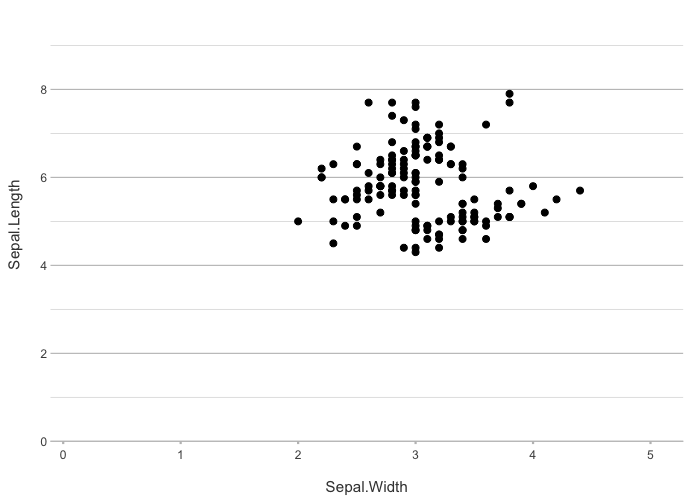
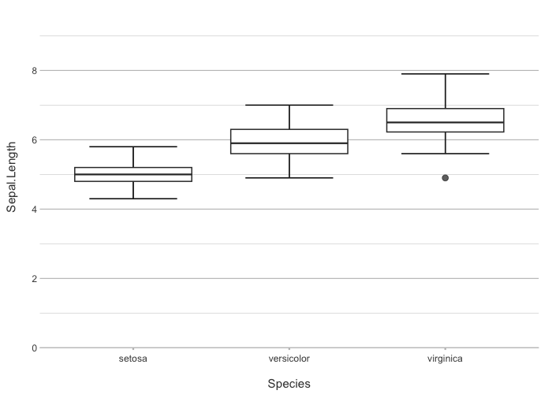
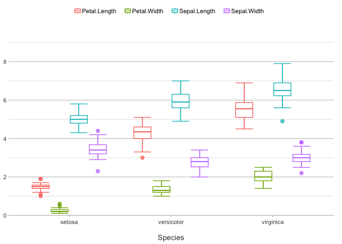
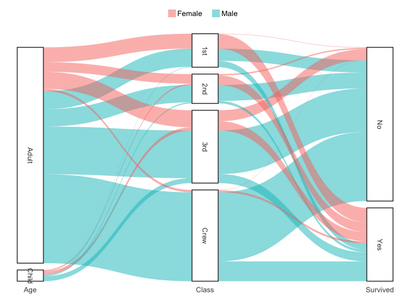

<!-- README.md is generated from README.Rmd; please edit that file. -->

<!-- Run with: suppressWarnings(rmarkdown::render("README.Rmd", quiet = TRUE)) -->

# `plot2`: Simplified and Enhanced Data Visualisation in R

`plot2` is a simple yet powerful extension of `ggplot2`, designed to
streamline the process of creating high-quality data visualisations in R
by taking away most of the work. Built with the philosophy of **Less
Typing, More Plotting**, `plot2` automates many of the routine tasks
that typically require a lot of typing when plotting with `ggplot2`. It
even renders pre-processing steps in, e.g., `dplyr`, `tidyr` and
`forcats` largely superfluous. This package allows you to focus on the
insights and stories your data can tell, rather than on the intricate
details of plot construction.

Where `ggplot2` usage involves writing many different *functions* (such
as `ggplot()`, `aes()`, `geom_col()`, `facet_wrap()`, `theme()`,
`scale_y_continuous()`, etc.), `plot2` usage only involves filling in
required *arguments* of a single function.

> For a **comprehensive guide to using `plot2`**, including advanced
> features and customisation options, please [see the full vignette
> here](https://msberends.github.io/plot2/articles/plot2.html).

## Key Features

- **Plotting With As Few Lines As Possible:** no need to type
  `ggplot()`, `aes()`, `geom_col()`, `facet_wrap()`, `theme()`, or
  `scale_y_continuous()` anymore, just one `plot2()` call will suffice.
- **Automatic Plot Selection:** `plot2` automatically chooses the best
  plot type based on your data, saving you time and effort.
- **In-line Data Transformations:** Eliminate the need for manual
  pre-processing steps e.g. in `dplyr` and `tidyr`, by performing data
  transformations directly within the plotting function, even for axis
  and plot titles.
- **Enhanced Sorting and Faceting:** Easily sort and facet your data
  with simple arguments, streamlining the creation of complex
  multi-panel plots.
- **New Clean Theme:** Includes `theme_minimal2()`, a new minimalist
  theme based on `theme_minimal()` that is further optimised for clear
  and professional outputs, therefore perfect for PDF publications,
  scientific manuscripts, and presentations.
- **Seamless Integration with ggplot2:** Retain all the power and
  flexibility of `ggplot2` while benefiting from `plot2`’s streamlined
  interface.

## Philosophy

`ggplot2` is a versatile tool that has become a cornerstone of data
visualisation in R, giving users unparalleled control over their plots.
However, with this flexibility often comes the need for repetitive and
verbose code, especially for routine tasks such as setting axis labels,
choosing plot types, or transforming data.

`plot2` is designed to complement `ggplot2` by offering a more
streamlined and intuitive interface. It simplifies the process of
creating plots by automatically handling many of the details, without
sacrificing the flexibility and power that `ggplot2` provides. Whether
you’re quickly exploring data or preparing a polished visualisation for
publication, `plot2` helps you get there faster with less code.

## Installation

You can install the latest version of `plot2` here:

``` r
install.packages("plot2",
                 repos = c("https://cran.r-project.org",
                           "https://msberends.r-universe.dev"))

# OR:

remotes::install_github("msberends/plot2")
```

## Examples

> For **all supported plot types**, please [see our plot type overview
> here](https://msberends.github.io/plot2/articles/supported_types.html).

Here’s how easy it is to get started with `plot2`:

``` r
library(plot2)

head(iris)
#>   Sepal.Length Sepal.Width Petal.Length Petal.Width Species
#> 1          5.1         3.5          1.4         0.2  setosa
#> 2          4.9         3.0          1.4         0.2  setosa
#> 3          4.7         3.2          1.3         0.2  setosa
#> 4          4.6         3.1          1.5         0.2  setosa
#> 5          5.0         3.6          1.4         0.2  setosa
#> 6          5.4         3.9          1.7         0.4  setosa

# no variables determined, so plot2() will try for itself -
# the type will be points since the first two variables are numeric
iris |>
  plot2()
#> ℹ Using category = Species
#> ℹ Using type = "point" since both axes are numeric
#> ℹ Using x = Sepal.Length
#> ℹ Using y = Sepal.Width
```


``` r

# if x and y are set, no additional mapping will be set:
iris |> 
  plot2(Sepal.Width, Sepal.Length)
#> ℹ Using type = "point" since both axes are numeric
```



``` r
iris |> 
  plot2(Species, Sepal.Length)
#> ℹ Using type = "boxplot" since all groups in Species contain at least three values
```



``` r

# the arguments are in this order: x, y, category, facet
iris |> 
  plot2(Sepal.Length, Sepal.Width, Petal.Length, Species)
#> ℹ Assuming facet.fixed_x = TRUE since the three x scales differ by less than 25%
#> ℹ Assuming facet.fixed_y = TRUE since the three y scales differ by less than 25%
#> ℹ Assuming facet.repeat_lbls_y = FALSE since y has fixed scales
#> ℹ Using type = "point" since both axes are numeric
```


``` r

iris |> 
  plot2(Sepal.Length, Sepal.Width, Petal.Length, Species,
        colour = "viridis") # set the viridis colours
#> ℹ Assuming facet.fixed_x = TRUE since the three x scales differ by less than 25%
#> ℹ Assuming facet.fixed_y = TRUE since the three y scales differ by less than 25%
#> ℹ Assuming facet.repeat_lbls_y = FALSE since y has fixed scales
#> ℹ Using type = "point" since both axes are numeric
```


``` r
# set your own colours
iris |> 
  plot2(Sepal.Length, Sepal.Width, Petal.Length, Species,
        colour = c("white", "red", "black"))
#> ℹ Assuming facet.fixed_x = TRUE since the three x scales differ by less than 25%
#> ℹ Assuming facet.fixed_y = TRUE since the three y scales differ by less than 25%
#> ℹ Assuming facet.repeat_lbls_y = FALSE since y has fixed scales
#> ℹ Using category.midpoint = 3.45 (the current category scale centre)
#> ℹ Using type = "point" since both axes are numeric
```


``` r

# y can also be multiple (named) columns
iris |> 
  plot2(x = Sepal.Length,
        y = c(Length = Petal.Length, Width = Petal.Width),
        category.title = "Petal property")
#> ℹ Using type = "point" since both axes are numeric
```


``` r
iris |>
  # with included selection helpers such as where(), starts_with(), etc.:
  plot2(x = Species, y = where(is.double))
#> ℹ Using type = "boxplot" since all groups in Species and category contain at least three values
#> ℹ Using y = c(Petal.Length, Petal.Width, Sepal.Length, Sepal.Width)
```



``` r
  
# the category type can be one or more aesthetics
iris |>
  plot2(zoom = TRUE,
        category.type = c("colour", "shape"),
        size = 3)
#> ℹ Using category = Species
#> ℹ Using type = "point" since both axes are numeric
#> ℹ Using x = Sepal.Length
#> ℹ Using y = Sepal.Width
```


``` r
iris |>
  plot2(zoom = TRUE,
        category = Petal.Length,
        category.type = c("colour", "size"),
        colour = "viridis")
#> ℹ Using type = "point" since both axes are numeric
#> ℹ Using x = Sepal.Length
#> ℹ Using y = Sepal.Width
```


``` r

# easily add a smooth
iris |>
  plot2(zoom = TRUE,
        smooth = TRUE)
#> ℹ Using category = Species
#> ℹ Using type = "point" since both axes are numeric
#> ℹ Using x = Sepal.Length
#> ℹ Using y = Sepal.Width
#> `geom_smooth()` using method = 'loess' and formula = 'y ~ x'
```


``` r
iris |>
  plot2(zoom = TRUE,
        smooth = TRUE,
        smooth.method = "lm")
#> ℹ Using category = Species
#> ℹ Using type = "point" since both axes are numeric
#> ℹ Using x = Sepal.Length
#> ℹ Using y = Sepal.Width
#> `geom_smooth()` using formula = 'y ~ x'
```


``` r

# support for secondary Y-axis
mtcars |>
  plot2(x = mpg,
        y = hp,
        y_secondary = disp ^ 2, 
        y_secondary.scientific = TRUE,
        title = "Secondary Y-axis sets colour to the axis titles")
#> ℹ Using type = "point" since both axes are numeric
```


``` r


admitted_patients
#> # A tibble: 250 × 7
#>    date       patient_id gender   age age_group hospital ward   
#>    <date>          <dbl> <chr>  <dbl> <ord>     <fct>    <chr>  
#>  1 2002-01-14          1 M         78 75+       D        Non-ICU
#>  2 2002-03-17          2 M         78 75+       C        Non-ICU
#>  3 2002-04-08          3 M         78 75+       A        ICU    
#>  4 2002-04-14          4 M         72 55-74     C        Non-ICU
#>  5 2002-05-07          5 M         83 75+       C        Non-ICU
#>  6 2002-05-16          6 F         65 55-74     B        ICU    
#>  7 2002-05-16          7 M         47 25-54     D        Non-ICU
#>  8 2002-06-18          8 M         30 25-54     B        ICU    
#>  9 2002-06-23          9 M         82 75+       D        Non-ICU
#> 10 2002-06-23          9 M         82 75+       D        Non-ICU
#> # ℹ 240 more rows

# the arguments are in this order: x, y, category, facet
admitted_patients |>
  plot2(hospital, age)
#> ℹ Using type = "boxplot" since all groups in hospital contain at least three values
```


``` r

admitted_patients |>
  plot2(hospital, age, gender)
#> ℹ Using type = "boxplot" since all groups in hospital and gender contain at least three values
```


``` r
  
admitted_patients |>
  plot2(hospital, age, gender, ward)
#> ℹ Assuming facet.fixed_y = TRUE since the two y scales differ by less than 25%
#> ℹ Assuming facet.repeat_lbls_y = FALSE since y has fixed scales
#> ℹ Using type = "boxplot" since all groups in hospital and gender and ward contain at least three values
```


``` r
  
# or use any function for y
admitted_patients |>
  plot2(hospital, median(age), gender, ward)
#> ℹ Assuming facet.fixed_y = TRUE since the two y scales differ by less than 25%
#> ℹ Assuming facet.repeat_lbls_y = FALSE since y has fixed scales
```


``` r
admitted_patients |>
  plot2(hospital, n(), gender, ward)
```


``` r
admitted_patients |>
  plot2(x = hospital,
        y = age,
        category = gender,
        colour = c("F" = "#3F681C", "M" = "#375E97"),
        colour_fill = "#FFBB00",
        linewidth = 1.25,
        y.age = TRUE)
#> ℹ Using type = "boxplot" since all groups in hospital and gender contain at least three values
```


``` r

admitted_patients |>
  plot2(age, type = "hist")
#> ℹ Assuming smooth = TRUE for type = "histogram"
#> ℹ Using binwidth = 6.4 based on data
```


``` r

# even titles support calculations, including support for {glue}
admitted_patients |>
  plot2(age, type = "hist",
        title = paste("Based on n =", n_distinct(patient_id), "patients"),
        subtitle = paste("Total rows:", n()),
        caption = glue::glue("From {n_distinct(hospital)} hospitals"),
        x.title = paste("Age ranging from", paste(range(age), collapse = " to ")))
#> ℹ Assuming smooth = TRUE for type = "histogram"
#> ℹ Using binwidth = 6.4 based on data
```


``` r
 
# the default type is column, datalabels are automatically
# set in non-continuous types:
admitted_patients |> 
  plot2(hospital, n(), gender)
```


``` r
  
admitted_patients |> 
  plot2(hospital, n(), gender,
        stacked = TRUE)
```


``` r
        
admitted_patients |> 
  plot2(hospital, n(), gender,
        stacked_fill = TRUE)
```


``` r

# two categories might benefit from a dumbbell plot:
admitted_patients |> 
  plot2(hospital, median(age), gender, type = "dumbbell")
```


``` r
 
# sort on any direction:
admitted_patients |> 
  plot2(hospital, n(), gender,
        x.sort = "freq-asc",
        stacked = TRUE)
#> ℹ Applying x.sort = "freq-asc" using summarise_function = sum
```


``` r

admitted_patients |> 
  plot2(hospital, n(), gender,
        x.sort = c("B", "D", "A"), # missing values ("C") will be added
        category.sort = "alpha-desc",
        stacked = TRUE)
```


``` r
        
# support for Sankey plots
Titanic |> # a table from base R
  plot2(x = c(Age, Class, Survived),
        category = Sex,
        type = "sankey")
#> ℹ Assuming sankey.remove_axes = TRUE
#> ! Input class 'table' was transformed using `as.data.frame()`
```



``` r
# matrix support, such as for cor()
correlation_matrix <- cor(mtcars)
class(correlation_matrix)
#> [1] "matrix" "array"
head(correlation_matrix)
#>             mpg        cyl       disp         hp       drat         wt        qsec         vs         am       gear       carb
#> mpg   1.0000000 -0.8521620 -0.8475514 -0.7761684  0.6811719 -0.8676594  0.41868403  0.6640389  0.5998324  0.4802848 -0.5509251
#> cyl  -0.8521620  1.0000000  0.9020329  0.8324475 -0.6999381  0.7824958 -0.59124207 -0.8108118 -0.5226070 -0.4926866  0.5269883
#> disp -0.8475514  0.9020329  1.0000000  0.7909486 -0.7102139  0.8879799 -0.43369788 -0.7104159 -0.5912270 -0.5555692  0.3949769
#> hp   -0.7761684  0.8324475  0.7909486  1.0000000 -0.4487591  0.6587479 -0.70822339 -0.7230967 -0.2432043 -0.1257043  0.7498125
#> drat  0.6811719 -0.6999381 -0.7102139 -0.4487591  1.0000000 -0.7124406  0.09120476  0.4402785  0.7127111  0.6996101 -0.0907898
#> wt   -0.8676594  0.7824958  0.8879799  0.6587479 -0.7124406  1.0000000 -0.17471588 -0.5549157 -0.6924953 -0.5832870  0.4276059
mtcars |> 
  cor() |>
  plot2()
#> ℹ Assuming type = "tile" since the matrix contains identical row and column names
#> ! Omitting printing of 121 datalabels - use datalabels = TRUE to force printing
```


``` r

mtcars |> 
  cor() |>
  plot2(colour = c("blue3", "white", "red3"),
        datalabels = TRUE,
        category.title = "*r*-value",
        title =  "Correlation matrix")
#> ℹ Assuming type = "tile" since the matrix contains identical row and column names
#> ℹ Using category.midpoint = 0 (the current category scale centre)
```


``` r


# plot2() supports all S3 extensions available through
# ggplot2::fortify() and broom::augment(), such as regression models:
lm(mpg ~ hp, data = mtcars) |> 
  plot2(x = mpg ^ -3,
        y = hp ^ 2,
        smooth = TRUE,
        smooth.method = "lm",
        smooth.formula = "y ~ log(x)",
        title = "Titles/captions *support* **markdown**",
        subtitle = "Axis titles contain the square notation: x^2")
#> ℹ Using type = "point" since both axes are numeric
```


``` r

# sf objects (geographic plots, 'simple features') are also supported
netherlands |> 
  plot2()
#> ℹ Assuming datalabels.centroid = TRUE. Set to FALSE for a point-on-surface placing of datalabels.
#> ℹ Using category = area_km2
#> ℹ Using datalabels = province
```


``` r
netherlands |> 
  plot2(colour_fill = "viridis", colour_opacity = 0.75) |>
  add_sf(netherlands, colour = "black", colour_fill = NA)
#> ℹ Assuming datalabels.centroid = TRUE. Set to FALSE for a point-on-surface placing of datalabels.
#> ℹ Using category = area_km2
#> ℹ Using datalabels = province
```


``` r
# support for any system or Google font
mtcars |>
  plot2(mpg, hp,
        font = "Rock Salt",
        title = "This plot uses a Google Font")
#> ℹ Using type = "point" since both axes are numeric
```


Like `plot()`, just pass `x`, `y` in the way you prefer:

``` r
plot2(mtcars, mpg, hp)

mtcars %>% plot2(mpg, hp)

plot2(hp ~ mpg, data = mtcars)

mtcars |> plot2(mpg, hp) # preferred method
```

## Shiny app

You can your plots interactively as well with the built-in Shiny app.
All `plot2` arguments are available in it. In RStudio, there is an addin
menu item too.

``` r
iris |>
  create_interactively()
```

<figure>

<figcaption aria-hidden="true">Shiny app example</figcaption>
</figure>

## Getting Involved

We welcome contributions to `plot2`, whether it’s through reporting
issues, suggesting features, or submitting pull requests. If you’re
familiar with `ggplot2` and the tidyverse, your insights will be
especially valuable as we continue to develop and refine the package.

## Previous Iteration

Though only released here in August 2024, this package has had years of
development with hundreds of Git commits in an earlier iteration
[here](https://github.com/certe-medical-epidemiology/certeplot2).

## License

This project is licensed under the GNU GPL v2.0 License - see the
[LICENSE](LICENSE.md) file for details.
