# An Introduction to \`plot2()\`: Enhancing Your \`ggplot2\` Workflow

## Introduction

If you’ve been using `ggplot2` for a while, you’re likely familiar with
its strengths and versatility in creating a wide array of
visualisations. However, as powerful as `ggplot2` is, it often requires
you to define every single detail yourself. Whether it’s specifying
aesthetics, selecting geoms, or adjusting scales, you’re in control of
every element. And that’s one of the reasons we love `ggplot2`; it
offers immense flexibility and precision.

But what if you could streamline this process for many common tasks?
Enter [`plot2()`](https://msberends.github.io/plot2/reference/plot2.md),
a friendly companion to `ggplot2` designed to reduce the repetitive
aspects of plotting without sacrificing the customizability that
`ggplot2` is known for. Think of
[`plot2()`](https://msberends.github.io/plot2/reference/plot2.md) as
your plotting assistant, doing a lot of the heavy lifting automatically
so you can focus on the fun parts — like exploring your data and finding
insights.

In this vignette, we’ll take a deep dive into the
[`plot2()`](https://msberends.github.io/plot2/reference/plot2.md)
function and its companion `add_*()` functions. We’ll walk through
everything from the basics to some of the more advanced features,
helping you unlock the full potential of this powerful tool. Whether
you’re plotting simple bar charts or complex Sankey diagrams,
[`plot2()`](https://msberends.github.io/plot2/reference/plot2.md) has
got you covered.

### The Plot2 Philosophy: Less Typing, More Plotting

Before we dive into the code, let’s talk briefly about the philosophy
behind
[`plot2()`](https://msberends.github.io/plot2/reference/plot2.md). At
its core,
[`plot2()`](https://msberends.github.io/plot2/reference/plot2.md) is
designed to make plotting in R more intuitive and less cumbersome. If
you’ve ever been frustrated by having to write out
[`ggplot()`](https://ggplot2.tidyverse.org/reference/ggplot.html) and
[`aes()`](https://ggplot2.tidyverse.org/reference/aes.html) over and
over again,
[`plot2()`](https://msberends.github.io/plot2/reference/plot2.md) is the
answer.

The concept is simple, and the exact opposite of `ggplot2`: give
[`plot2()`](https://msberends.github.io/plot2/reference/plot2.md) your
data, and it will figure out the rest, while enabling many popular
plotting options without ever needing to leave this single function. The
goal is to get you from data to visualisation with as little friction as
possible. And since
[`plot2()`](https://msberends.github.io/plot2/reference/plot2.md) just
returns a `ggplot` object, you can extend it in any way you would with
the outcome of
[`ggplot()`](https://ggplot2.tidyverse.org/reference/ggplot.html).

This philosophy shines particularly in how
[`plot2()`](https://msberends.github.io/plot2/reference/plot2.md)
simplifies functionalities like faceting, theming, and applying in-line
transformations. Rather than managing multiple functions and layers,
[`plot2()`](https://msberends.github.io/plot2/reference/plot2.md) allows
you to achieve the same results more directly.

## Getting Started with `plot2()`

Let’s start with the basics. The
[`plot2()`](https://msberends.github.io/plot2/reference/plot2.md)
function is a wrapper around `ggplot2` that simplifies many of the tasks
you usually have to handle manually. To begin with, you don’t even need
to specify what kind of plot you want —
[`plot2()`](https://msberends.github.io/plot2/reference/plot2.md) will
make an educated guess based on your data.

### Basic Usage: Let `plot2()` Do the Work

To get started, you can pass your data directly into
[`plot2()`](https://msberends.github.io/plot2/reference/plot2.md)
without specifying any additional arguments. For example:

``` r
# Load the package
library(plot2)

df <- data.frame(group = c("A", "B", "C", "D"),
                 values = c(105, 120, 114, 136))
df |>
  plot2()
```

    #> ℹ Using x = group
    #> ℹ Using y = values


In this simple example,
[`plot2()`](https://msberends.github.io/plot2/reference/plot2.md)
automatically generates a column plot because it recognises that the
X-axis is categorical and the Y-axis is numeric. It even adds data
labels by default because the X-axis is discrete. Also, at the top of
the Y-axis there is a bit more space to better be able to read the plot,
akin to how Microsoft Excel plots at default. This is
[`plot2()`](https://msberends.github.io/plot2/reference/plot2.md) at its
most basic — no need to specify a plot type or worry about details like
labels and scales.

You’ll also notice the clean, uncluttered appearance of the plot,
especially when compared to a default `ggplot2` plot, thanks to
[`theme_minimal2()`](https://msberends.github.io/plot2/reference/theme_minimal2.md),
which is applied by default in
[`plot2()`](https://msberends.github.io/plot2/reference/plot2.md).
Unlike `ggplot2`’s default
[`theme_grey()`](https://ggplot2.tidyverse.org/reference/ggtheme.html)
that features a grey background,
[`theme_minimal2()`](https://msberends.github.io/plot2/reference/theme_minimal2.md)
provides an even more spacious, white background that reduces visual
clutter and is optimised for printing directly to production formats
like PDFs. This makes
[`plot2()`](https://msberends.github.io/plot2/reference/plot2.md) plots
ideal for reports, publications, and presentations where a clean,
professional look is essential.

### Customising the Plot Type

But what if you want something different? Maybe a scatter plot or a line
chart? No problem. You can easily specify the `type` argument to get
exactly what you want.

``` r
df |> 
  plot2(type = "l")
#> ℹ Using x = group
#> ℹ Using y = values
```


Here, we’ve explicitly set `type = "l"` to create a line plot.
[`plot2()`](https://msberends.github.io/plot2/reference/plot2.md)
supports a wide range of plot types, and you can use either the full
name (`type = "geom_line"`) or an abbreviation (`type = "line"`,
`type = "l"`).

This flexibility can save you from remembering multiple `ggplot2`
functions like
[`geom_point()`](https://ggplot2.tidyverse.org/reference/geom_point.html),
[`geom_line()`](https://ggplot2.tidyverse.org/reference/geom_path.html),
and
[`geom_col()`](https://ggplot2.tidyverse.org/reference/geom_bar.html).
With [`plot2()`](https://msberends.github.io/plot2/reference/plot2.md),
these are all accessible through a simple `type` argument, making your
workflow more intuitive.

### A Closer Look at the Axes

One of the key strengths of
[`plot2()`](https://msberends.github.io/plot2/reference/plot2.md) is how
it handles axes. The `x` and `y` arguments are straightforward, but they
come with a lot of flexibility. Let’s start with the basics and then
build up to more advanced configurations.

#### Setting Up Basic Axes

To create a simple scatter plot, you might pass a single variable to the
`x` and `y` arguments:

``` r
mtcars |>
  plot2(mpg, hp)
```

    #> ℹ Using type = "point" since both axes are numeric

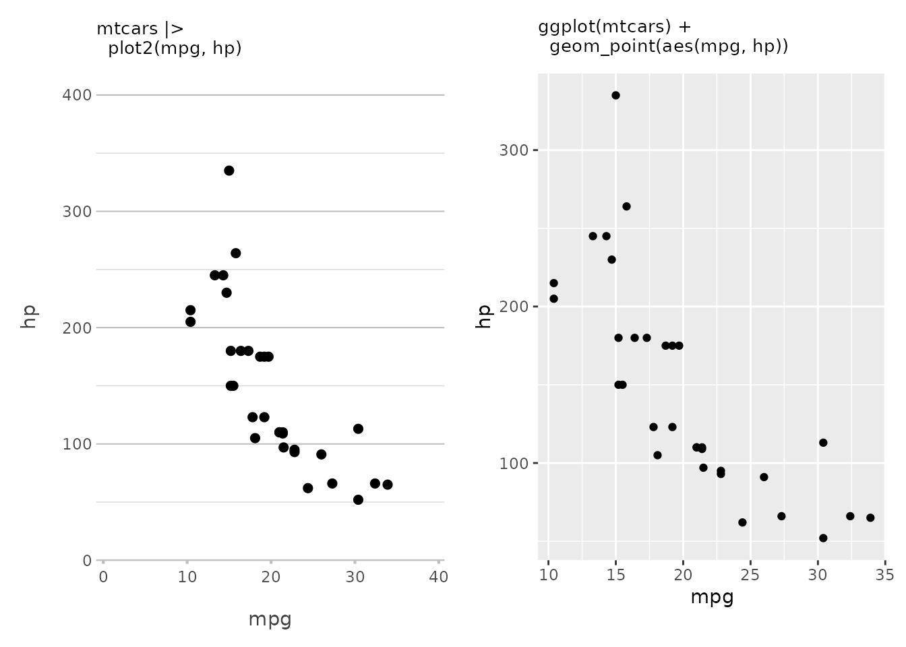

This creates a scatter plot of miles per gallon (`mpg`) against
horsepower (`hp`). This is as basic as it gets — two variables, one for
each axis. Also,
[`plot2()`](https://msberends.github.io/plot2/reference/plot2.md) always
tries to start at zero for both `x` and `y` (which can be set with
`x.expand` and `y.expand`). With
[`ggplot()`](https://ggplot2.tidyverse.org/reference/ggplot.html), the
default plot is ‘zoomed in’ to the data region.

#### Working with Multiple Variables

Now, what if you want to compare multiple variables on the same plot?
[`plot2()`](https://msberends.github.io/plot2/reference/plot2.md) makes
this easy by allowing you to pass a vector of variables:

``` r
mtcars |> 
  plot2(x = mpg, y = c(hp, disp))
#> ℹ Using type = "point" since both axes are numeric
```

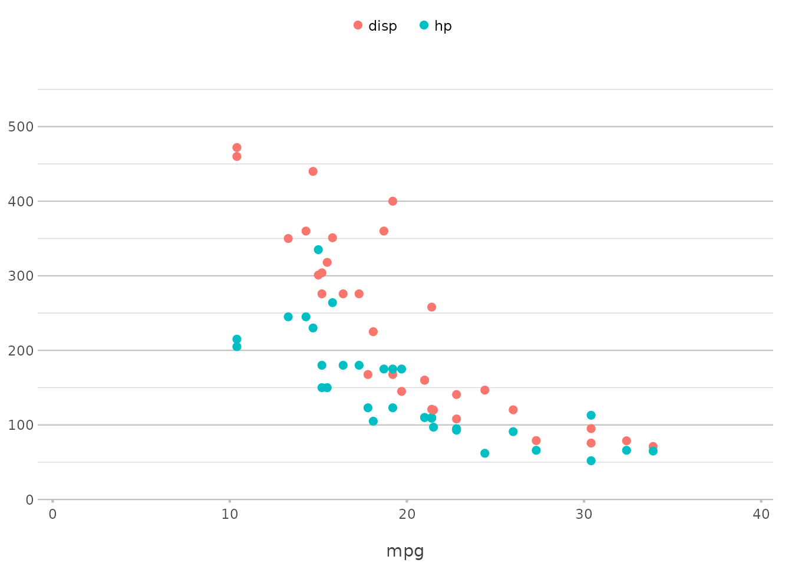

In this example,
[`plot2()`](https://msberends.github.io/plot2/reference/plot2.md) plots
both `hp` and `disp` against `mpg` on the same graph, using different
colours or other visual distinctions to separate them. This
functionality replaces the need for pre-processing steps such as
[`tidyr::pivot_longer()`](https://tidyr.tidyverse.org/reference/pivot_longer.html)
for the selected variables, simplifying the code significantly.

### Delving into Categories

Categories in
[`plot2()`](https://msberends.github.io/plot2/reference/plot2.md)
replace the `colour` and `fill` aesthetics from `ggplot2`. The
`category` argument is where you define how your data should be grouped.
Let’s start with a simple example and then explore how to take it
further.

#### Basic Grouping

A basic use of the `category` argument might look something like this:

``` r
mtcars |> 
  plot2(mpg, hp, category = cyl)
#> ℹ Using type = "point" since both axes are numeric
```


Here, the `cyl` variable is used to group the data by the number of
cylinders, and
[`plot2()`](https://msberends.github.io/plot2/reference/plot2.md)
automatically assigns different colours to each group. This is
particularly useful for comparing subsets of your data within the same
plot.

In `ggplot2`, this would typically involve specifying
`aes(colour = ...)` or `aes(fill = ...)` within a `geom` function.
[`plot2()`](https://msberends.github.io/plot2/reference/plot2.md)
simplifies this by handling it directly through the `category` argument,
reducing the need for manually setting aesthetics.

#### Customising Categories

But [`plot2()`](https://msberends.github.io/plot2/reference/plot2.md)
doesn’t stop there. You can fully customise how categories are
displayed. For instance, you might want to control the colours used for
each category:

``` r
mtcars |> 
  plot2(mpg, hp, category = cyl,
        colour = c("4" = "red", "6" = "blue", "8" = "green"))
#> ℹ Using category.midpoint = 7 (the current category scale centre)
#> ℹ Using type = "point" since both axes are numeric
```


Here, we’ve specified the exact colours to use for each category, giving
you full control over the appearance of your plot.

This approach mirrors what you would do with
[`scale_colour_manual()`](https://ggplot2.tidyverse.org/reference/scale_manual.html)
or
[`scale_fill_manual()`](https://ggplot2.tidyverse.org/reference/scale_manual.html)
in `ggplot2`, but in a more streamlined and integrated manner.

### Exploring Facets

Faceting in
[`plot2()`](https://msberends.github.io/plot2/reference/plot2.md) allows
you to split your plot into multiple panels, one for each level of a
categorical variable. It’s an excellent way to compare data across
different groups.

#### Basic Faceting

A simple example of faceting might look like this:

``` r
mtcars |> 
  plot2(mpg, hp, facet = gear)
#> ℹ Assuming facet.fixed_x = TRUE since the three x scales differ by less than
#> 25%
#> ℹ Using type = "point" since both axes are numeric
```

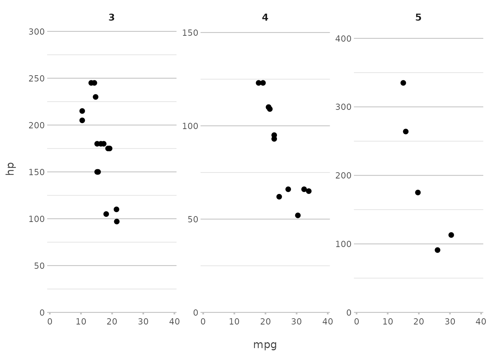

This command splits the plot by the number of gears, giving you a
separate panel for each group. This is a quick way to see how
relationships vary across different subsets of your data.

In `ggplot2`, achieving this would typically require
`facet_wrap(~ gear)` or `facet_grid(gear ~ .)`. With
[`plot2()`](https://msberends.github.io/plot2/reference/plot2.md), you
achieve the same effect with a simple `facet` argument, making it more
intuitive and easier to remember.

#### Advanced Faceting Options

[`plot2()`](https://msberends.github.io/plot2/reference/plot2.md) offers
additional control over how facets are displayed. You can specify the
number of rows in the facet grid, control whether scales are fixed or
free, and more.

``` r
mtcars |> 
  plot2(mpg, hp, facet = starts_with("g"), facet.nrow = 2, facet.fixed_y = TRUE)
#> ℹ Assuming facet.fixed_x = TRUE since the three x scales differ by less than
#> 25%
#> ℹ Assuming facet.repeat_lbls_y = FALSE since y has fixed scales
#> ℹ Using type = "point" since both axes are numeric
```


In this example, we limit the facet grid to two rows and ensure that all
y-axes have the same scale. This simplifies `ggplot2`’s more complex
[`facet_wrap()`](https://ggplot2.tidyverse.org/reference/facet_wrap.html)
options like `scales = "free_y"` and `nrow`, which often require
additional parameters.

### Leveraging In-line Transformations with `plot2()`

One of the standout features of
[`plot2()`](https://msberends.github.io/plot2/reference/plot2.md) is its
ability to perform transformations directly within the function call.
This capability can dramatically reduce the need for additional data
manipulation steps, allowing you to focus on the visualisation itself.
Whether you’re calculating aggregates, formatting labels, or even
applying mathematical transformations,
[`plot2()`](https://msberends.github.io/plot2/reference/plot2.md) lets
you do it all on the fly.

#### Aggregations Made Easy

Suppose you want to count the number of patients admitted to each
hospital. With
[`plot2()`](https://msberends.github.io/plot2/reference/plot2.md),
there’s no need to pre-calculate these counts; you can simply use
[`n_distinct()`](https://dplyr.tidyverse.org/reference/n_distinct.html)
to get the unique numbers of patients directly within the function:

``` r
admitted_patients |> 
  plot2(x = hospital,
        y = n_distinct(patient_id))
```


This will produce a column plot showing the number of admissions per
hospital, calculated directly within
[`plot2()`](https://msberends.github.io/plot2/reference/plot2.md).

#### Combining Data with In-line Transformations

The real power of
[`plot2()`](https://msberends.github.io/plot2/reference/plot2.md) comes
when you start combining these in-line transformations. Want to add
another dimension, like the number of unique age groups within each
hospital? You can do that just as easily:

``` r
admitted_patients |> 
    plot2(x = hospital,
          y = n_distinct(patient_id),
          category = ifelse(date < "2010-01-01", "Prior to 2010", "Since 2010"),
          facet = ward,
          title = paste("Total of", n(), "patients"))
#> ℹ Assuming facet.fixed_y = TRUE since the two y scales differ by less than 25%
#> ℹ Assuming facet.repeat_lbls_y = FALSE since y has fixed scales
```

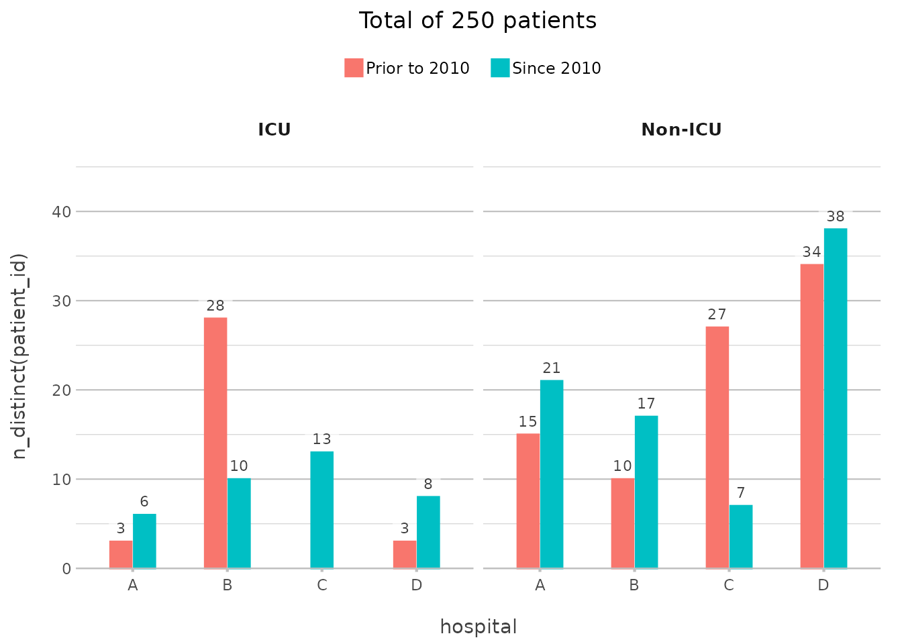

Here, the [`ifelse()`](https://rdrr.io/r/base/ifelse.html) in category
adds the grouping on date, counting the number of unique patients per
ward per hospital, again with no need for additional code outside of
[`plot2()`](https://msberends.github.io/plot2/reference/plot2.md).

You didn’t need to
[`group_by()`](https://dplyr.tidyverse.org/reference/group_by.html) or
[`summarise()`](https://dplyr.tidyverse.org/reference/summarise.html)
your data beforehand —
[`plot2()`](https://msberends.github.io/plot2/reference/plot2.md) takes
care of it all, embedding the transformation directly into the plot
creation process.

In [`plot2()`](https://msberends.github.io/plot2/reference/plot2.md),
these tidyverse functions are available without loading other packages:
`%>%()`,
[`all_of()`](https://tidyselect.r-lib.org/reference/all_of.html),
[`any_of()`](https://tidyselect.r-lib.org/reference/all_of.html),
[`ends_with()`](https://tidyselect.r-lib.org/reference/starts_with.html),
[`everything()`](https://tidyselect.r-lib.org/reference/everything.html),
[`first()`](https://dplyr.tidyverse.org/reference/nth.html),
[`last()`](https://dplyr.tidyverse.org/reference/nth.html),
[`matches()`](https://tidyselect.r-lib.org/reference/starts_with.html),
[`n()`](https://dplyr.tidyverse.org/reference/context.html),
[`n_distinct()`](https://dplyr.tidyverse.org/reference/n_distinct.html),
[`starts_with()`](https://tidyselect.r-lib.org/reference/starts_with.html),
[`where()`](https://tidyselect.r-lib.org/reference/where.html).

``` r
admitted_patients |> 
  plot2(x = hospital, y = median(age), category = gender)
```

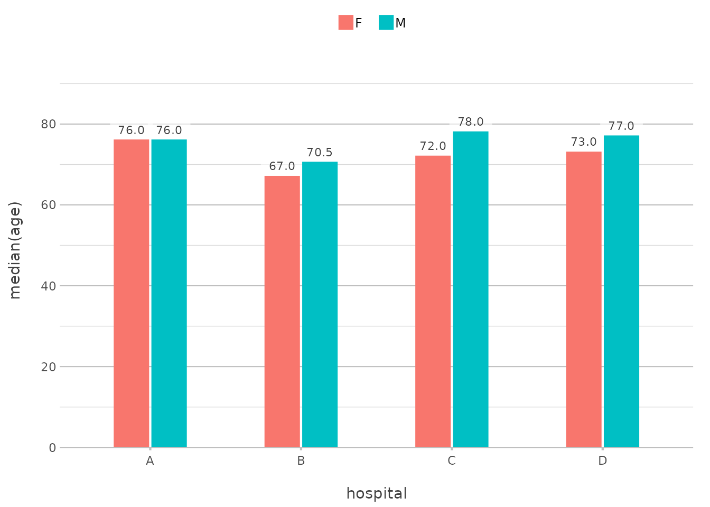

#### In-line Math Transformations

You can also apply mathematical transformations directly within
[`plot2()`](https://msberends.github.io/plot2/reference/plot2.md),
making it easy to explore relationships in your data. For example, to
plot the logarithm of patient ages across different wards, you can do
this:

``` r
admitted_patients |> 
  plot2(x = log(age), y = n(), y.transform = "log2", category = ward)
#> ℹ Using type = "point" since both axes are numeric
```

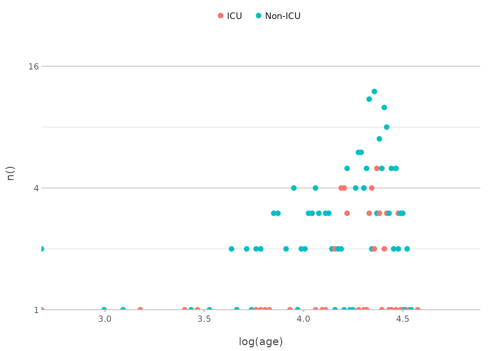

In a traditional `ggplot2` approach, you might have to create a new
variable in your data for the logarithmic transformation
(`mutate(log_age = log(age))`) before plotting, and a
`scale_y_continuous(transform = "log2")` for the Y-axis.
[`plot2()`](https://msberends.github.io/plot2/reference/plot2.md)
handles this seamlessly within the plotting function itself.

#### Advanced Formatting on the Fly

In addition to aggregations,
[`plot2()`](https://msberends.github.io/plot2/reference/plot2.md) makes
it easy to apply text transformations directly within the plotting
function. For instance, you might want to format the date or combine
different variables for the labels:

``` r
admitted_patients |> 
  plot2(x = paste("Hospital", hospital),
        y = n(),
        category = format(date, "%Y"))
#> ! Omitting printing of 60 datalabels - use datalabels = TRUE to force printing
```

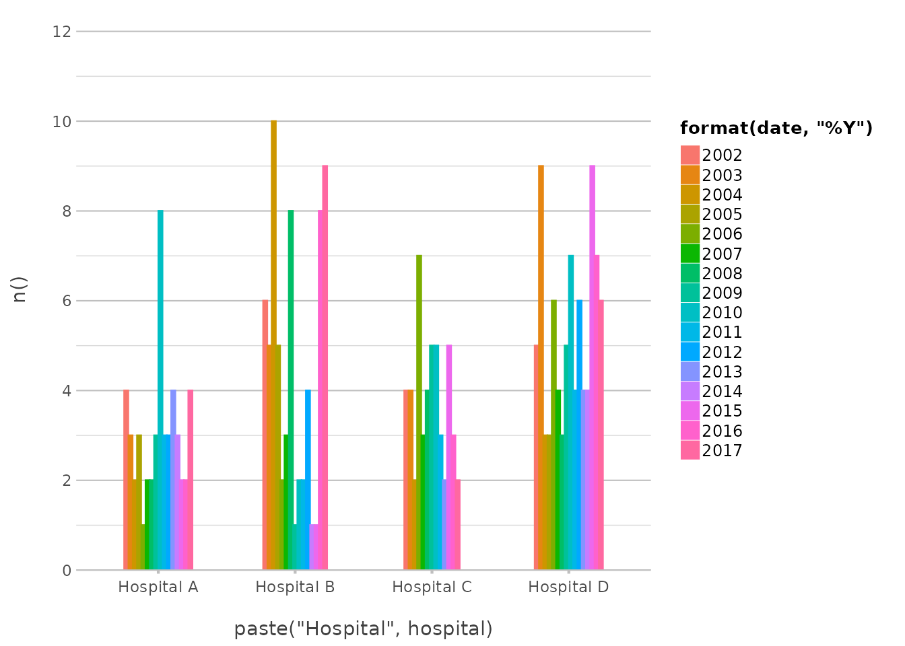

This example creates a plot where the X-axis labels combine the text
“Hospital” with the hospital name, and the categories are based on the
year extracted from the `date` variable. This level of flexibility
allows for highly customised plots without the need for extra
preprocessing steps.

#### Combining Everything Together

Let’s put it all together in a more complex example. Suppose you want to
examine the distribution of patient ages across hospitals, with each bar
split by gender, and you want the X-axis to reflect the hospital name
and use facets for the year of admission:

``` r
admitted_patients |> 
  plot2(x = ifelse(gender == "F", "Females", "Males"),
        y = median(age),
        category = format(date, "%Y"),
        facet = paste("Hospital", hospital),
        x.title = "",
        y.title = "Median Patient Age",
        y.labels = function(x) paste(x, "yrs"),
        category.title = "Year")
#> ℹ Assuming facet.fixed_y = TRUE since the four y scales differ by less than 25%
#> ℹ Assuming facet.repeat_lbls_y = FALSE since y has fixed scales
#> ! Omitting printing of 106 datalabels - use datalabels = TRUE to force printing
```

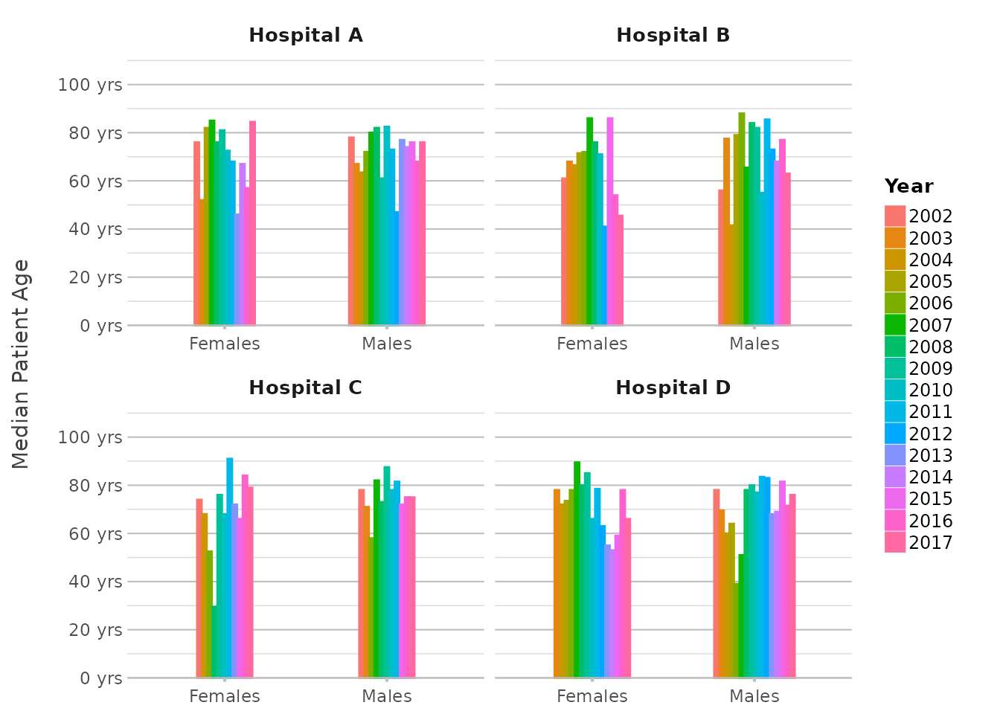

In this plot, we’re using multiple in-line transformations, showcasing
the use of only 8 lines of code without using `dplyr` transformations
manually. This level of complexity, achieved with just one
[`plot2()`](https://msberends.github.io/plot2/reference/plot2.md) call,
demonstrates the power and flexibility of in-line transformations.

### Sorting and Limiting Data

Sorting is a crucial part of data visualisation, as it helps bring
clarity and focus to your plots. With
[`plot2()`](https://msberends.github.io/plot2/reference/plot2.md), you
have a variety of options to sort your data in different directions.
Whether you want to sort by frequency, alphabetically, or by a custom
order, [`plot2()`](https://msberends.github.io/plot2/reference/plot2.md)
provides flexible and powerful tools to get the job done.

Limiting your data helps in keeping plots clean. If you only want to
display the top few items, `x.max_items` and `category.max_items`, and
`facet.max_items` have got you covered.

#### Basic Sorting

Let’s start with a simple sort based on frequency:

``` r
mtcars |> 
  plot2(carb, y = n(), x.sort = "freq-desc")
#> ℹ Using x.character = TRUE since x.sort is set
```

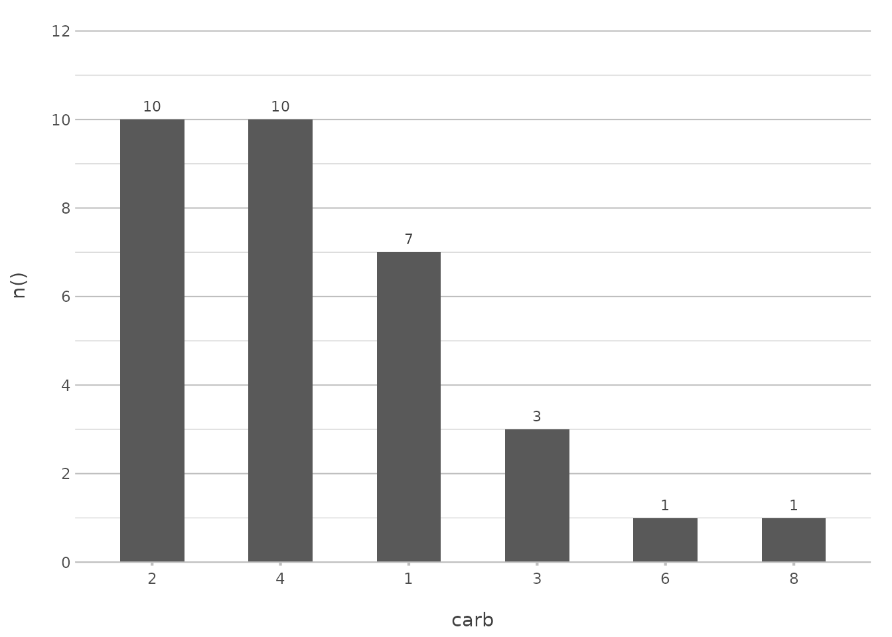

In this example, the data is sorted by the frequency of carburettor
counts in descending order. This is particularly useful when you want to
highlight the most common categories in your data.

This command is akin to the functionality provided by
`arrange(desc(...))` combined with `geom_bar(stat = "identity")`.
However,
[`plot2()`](https://msberends.github.io/plot2/reference/plot2.md)
condenses this into a single, intuitive step.

#### Sorting Alphabetically

If you prefer to sort alphabetically,
[`plot2()`](https://msberends.github.io/plot2/reference/plot2.md) makes
it straightforward. You can use `"asc"` or `"alpha"` to sort your data
in ascending alphabetical order:

``` r
mtcars |> 
  plot2(carb, y = n(), x.sort = "asc")
#> ℹ Using x.character = TRUE since x.sort is set
```

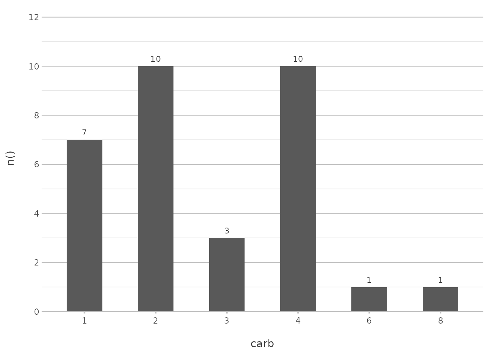

This command will sort the carburettor counts alphabetically, which is
useful when your data naturally follows an alphabetical order.

In `ggplot2`, achieving this often involves using
[`factor()`](https://rdrr.io/r/base/factor.html) levels or reordering
factors manually. With
[`plot2()`](https://msberends.github.io/plot2/reference/plot2.md),
sorting becomes a simple matter of choosing the appropriate argument.

#### Sorting with a Custom Order

Sometimes, you may want to present your data in a specific order that
doesn’t follow a standard sorting method. You can define a custom order
by providing a manual vector of values:

``` r
mtcars |> 
  plot2(carb, y = n(), x.sort = c(4, 1, 6, 8))
#> ℹ Using x.character = TRUE since x.sort is set
```


In this example, the carburettor counts will be displayed in the order
of 4, 1, 6, and 8, regardless of their frequency or alphabetical order.
This approach is particularly useful when you want to highlight certain
categories or follow a logical sequence.

In `ggplot2`, this would typically involve setting `levels` manually
within a factor, which can be cumbersome.
[`plot2()`](https://msberends.github.io/plot2/reference/plot2.md)
streamlines this by allowing custom orders directly within the
[`plot2()`](https://msberends.github.io/plot2/reference/plot2.md)
function call.

#### Limiting Data

You might not always want to show every single item in your plot. For
example, if you’re dealing with a lot of categories, you can limit the
display to just the most frequent ones:

``` r
mtcars |> 
  plot2(carb, y = n(), x.max_items = 5, type = "col")
#> ℹ Using x.character = TRUE for discrete plot type (geom_col) since carb is
#> numeric
```

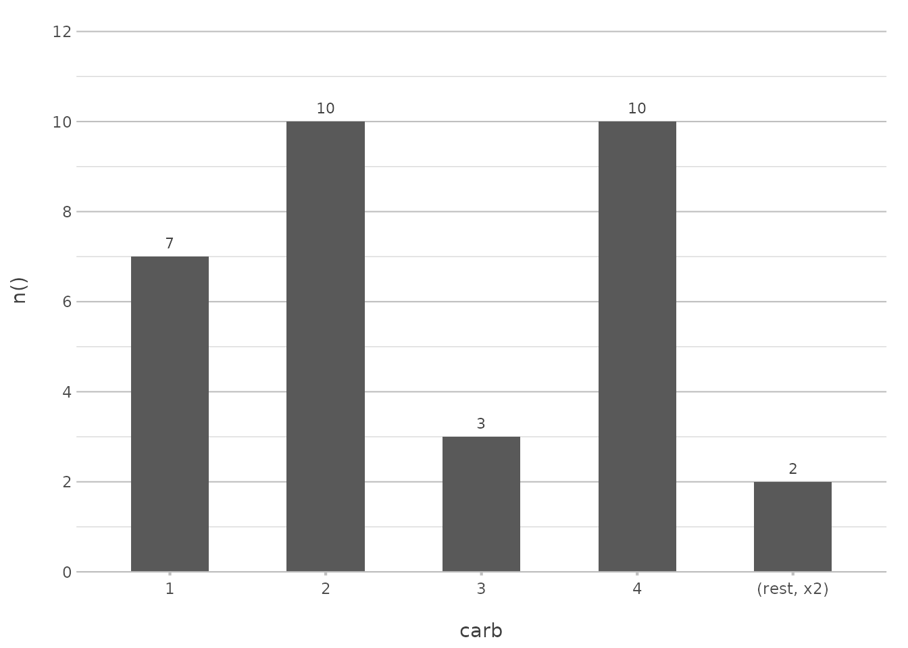

This limits the plot to the top 5 most frequent carburetor counts,
simplifying the visualisation and making it easier to focus on the most
important data.

In `ggplot2`, you might need to filter your data with
[`top_n()`](https://dplyr.tidyverse.org/reference/top_n.html) before
plotting.
[`plot2()`](https://msberends.github.io/plot2/reference/plot2.md)
handles this within the plotting function, further reducing the need for
external data manipulation.

#### Combining Sorting with Limiting

Sorting can be combined with other features in
[`plot2()`](https://msberends.github.io/plot2/reference/plot2.md) to
create more sophisticated plots. For example, you might want to sort by
frequency and also limit the number of items displayed:

``` r
mtcars |> 
  plot2(carb, y = n(), x.sort = "freq-desc", x.max_items = 5, type = "col")
#> ℹ Using x.character = TRUE for discrete plot type (geom_col) since carb is
#> numeric
```


This plot will show only the top 5 most frequent carburettor counts,
sorted in descending order. This combination helps to declutter your
visualisation and focus on the most significant parts of your data.

In a `ggplot2` approach, this might involve combining
[`arrange()`](https://dplyr.tidyverse.org/reference/arrange.html),
[`top_n()`](https://dplyr.tidyverse.org/reference/top_n.html), and
[`geom_col()`](https://ggplot2.tidyverse.org/reference/geom_bar.html).
[`plot2()`](https://msberends.github.io/plot2/reference/plot2.md)
consolidates these operations into a single, coherent function call.

#### Visualising Sorting Options

To illustrate the impact of different sorting options, let’s create a
plot that uses a custom sort order and highlights the flexibility of
[`plot2()`](https://msberends.github.io/plot2/reference/plot2.md):

``` r
admitted_patients |> 
  plot2(x = age_group, y = n(), x.sort = c("55-74", "75+", "25-54"), category = hospital, stacked = TRUE)
```


In this example, the `age_group` axis is sorted in a custom order, with
the “55-74” group first, followed by “75+” and then “25-54”. The bars
are stacked by hospital, providing a clear comparison across the
specified age groups.

This functionality parallels `ggplot2`’s ability to reorder factors
using
[`forcats::fct_relevel()`](https://forcats.tidyverse.org/reference/fct_relevel.html)
or manually reordering levels within a factor, but with less effort and
more clarity.

### Customising Colours

Customising colours in
[`plot2()`](https://msberends.github.io/plot2/reference/plot2.md) is
intuitive and flexible. You can use pre-set colour scales like
`viridis`, or define your own colours. The `colour` and `colour_fill`
arguments control the appearance of your plot.

#### Using Pre-set Colour Scales

For a quick and visually appealing colour scheme, you might use a
`viridis` palette:

``` r
mtcars |> 
  plot2(mpg, hp, category = cyl, colour = "viridis")
#> ℹ Using type = "point" since both axes are numeric
```

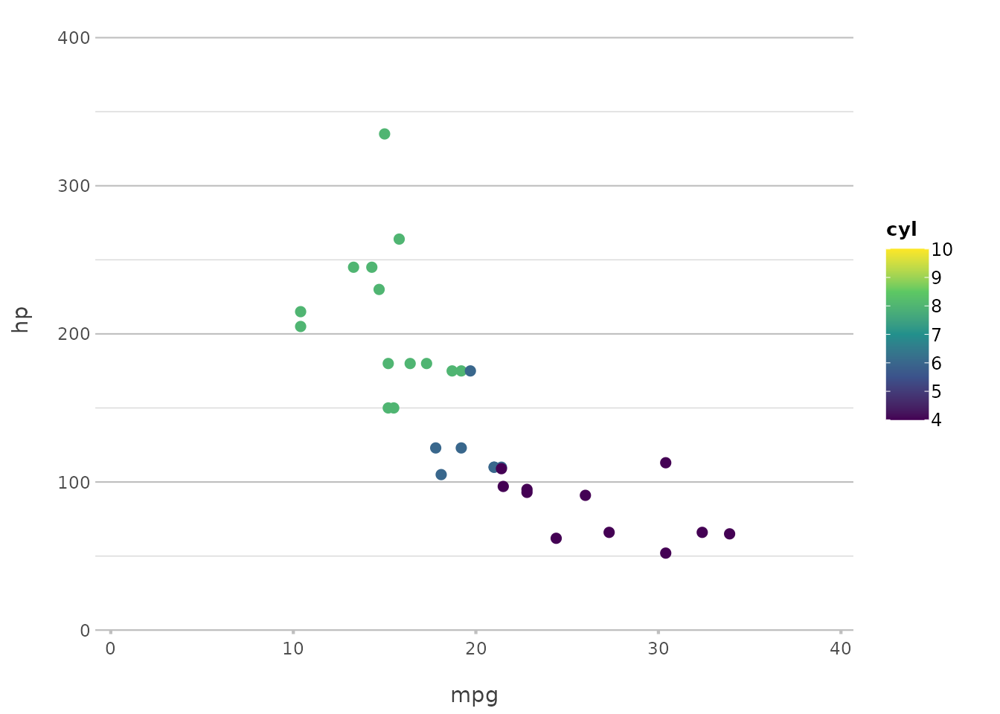

This applies the `viridis` colour scale, which is particularly good for
making sure your plot is accessible to those with colour vision
deficiencies.

This replaces the need for `ggplot2`’s
[`scale_colour_viridis_c()`](https://ggplot2.tidyverse.org/reference/scale_viridis.html)
or
[`scale_fill_viridis_c()`](https://ggplot2.tidyverse.org/reference/scale_viridis.html),
providing a more straightforward interface.

#### Defining Custom Colours

If you want more control, you can define specific colours for each
category:

``` r
mtcars |> 
  plot2(mpg, hp, category = cyl, colour = c("4" = "red", "6" = "blue", "8" = "green"))
#> ℹ Using category.midpoint = 7 (the current category scale centre)
#> ℹ Using type = "point" since both axes are numeric
```


You can use any colour that the implemented
[`get_colour()`](https://msberends.github.io/plot2/reference/colour.md)
function can understand, such as colour names and HTML codes:

``` r
get_colour("red")
#> [1] "#FF0000" 
get_colour("#FF0000")
#> [1] "#FF0000" 
get_colour("ff0000")
#> [1] "#FF0000" 
get_colour("f00")
#> [1] "#FF0000" 
```

But most importantly, you can register new colours to the `plot2`
package. Let’s assume these six colours are from the style of your
university/company/etc.:

``` r
register_colour(navy_blue = "#1F3A93",
                burnt_orange = "#D35400",
                forest_green = "#2C6F47",
                goldenrod_yellow = "#DAA520",
                slate_grey = "#708090",
                plum_purple = "#8E4585")
#> 6 colours registered.

# Then register the whole colour list too:
register_colour(OurOrganisation = c("navy_blue", "burnt_orange",
                                    "forest_green", "goldenrod_yellow",
                                    "slate_grey", "plum_purple"))
#> 1 colour set registered.
```

You can now use these colours in your plots!

``` r
iris |>
  plot2(x = Species, y = where(is.double), colour = "OurOrganisation")
#> ℹ Using type = "boxplot" since all groups in Species and category contain at
#> least three values
#> ℹ Using y = c(Petal.Length, Petal.Width, Sepal.Length, Sepal.Width)
```


This approach mirrors `ggplot2`’s
[`scale_colour_manual()`](https://ggplot2.tidyverse.org/reference/scale_manual.html)
but with an added layer of flexibility through the
[`register_colour()`](https://msberends.github.io/plot2/reference/colour.md)
function. This makes it easier to maintain consistent branding or
theme-specific colours across multiple plots.

#### Default Colours

At default,
[`plot2()`](https://msberends.github.io/plot2/reference/plot2.md) sets
no colours, meaning that it uses ggplot2 colours. With some simple R
options, it is very easy to switch to another colour set.

Default:

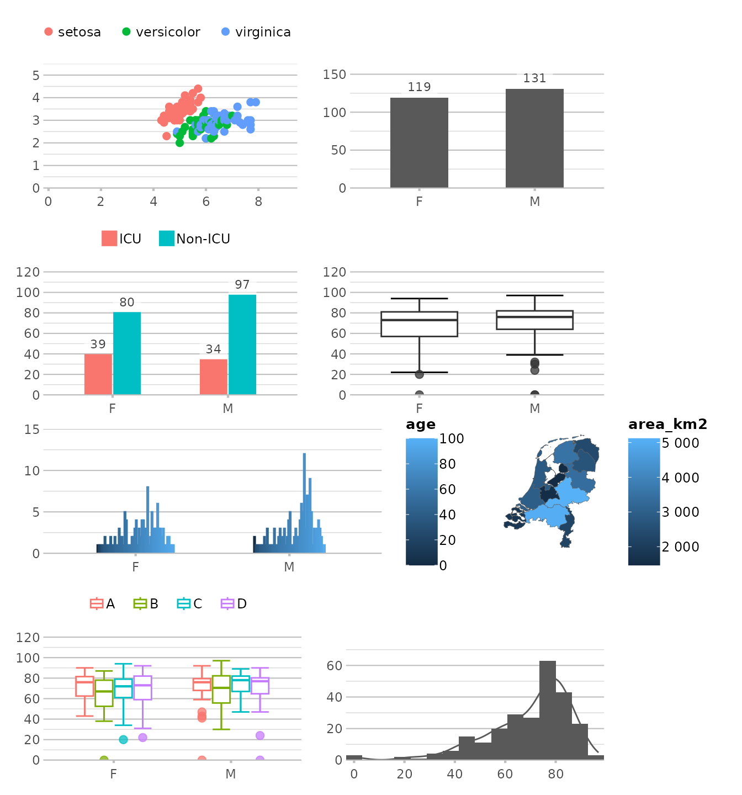

Using any [viridis colour
palette](https://sjmgarnier.github.io/viridis/articles/intro-to-viridis.html):

``` r
options(plot2.colour = "viridis")
```


``` r
options(plot2.colour = "magma")
```

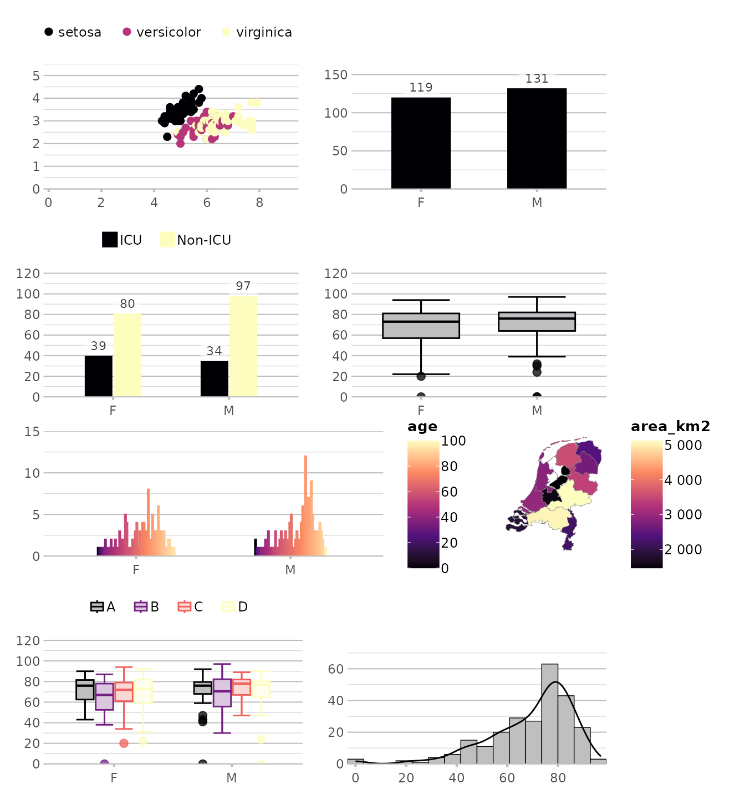

``` r
# our previously set manual colour set:
options(plot2.colour = "OurOrganisation")
```

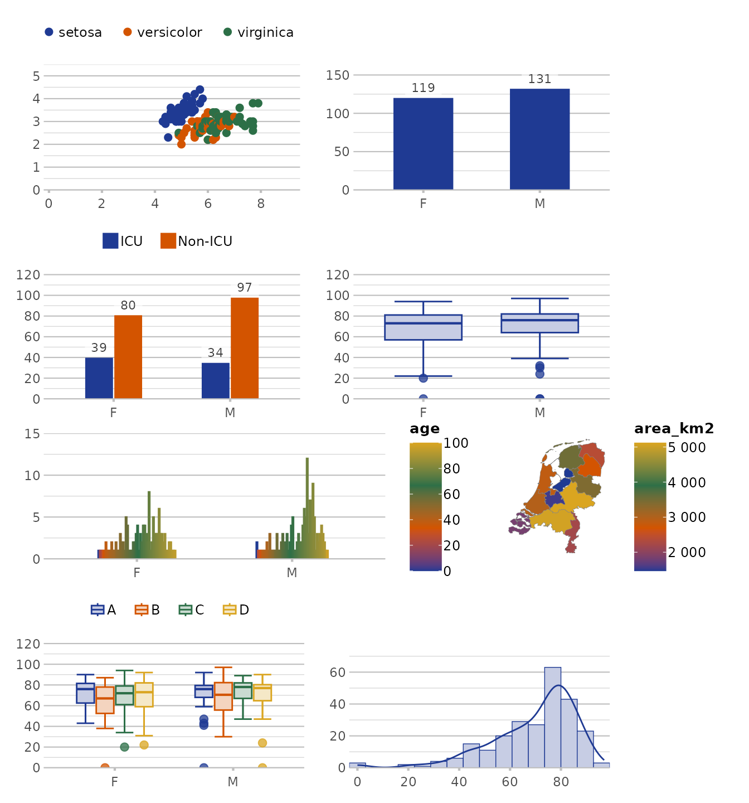

### Advanced Plot Types

[`plot2()`](https://msberends.github.io/plot2/reference/plot2.md) shines
when it comes to more complex plot types, such as geography plots,
spider plots, UpSet plots, back-to-back (butterfly) plots, dumbbell
plots and Sankey diagrams.

You can read about them in **our [plot type overview
here](https://msberends.github.io/plot2/articles/supported_types.html)**.

### Adding Elements with `add_*()` Functions

Beyond the basics,
[`plot2()`](https://msberends.github.io/plot2/reference/plot2.md) allows
you to add layers and elements to your plots with the `add_*()`
functions. These are designed to integrate seamlessly with
[`plot2()`](https://msberends.github.io/plot2/reference/plot2.md) and
`ggplot2`.

#### Adding Lines, Points, and Columns

Adding a line to an existing plot is as easy as calling
[`add_line()`](https://msberends.github.io/plot2/reference/add_type.md):

``` r
p <- mtcars |> 
  plot2(mpg, hp, as.character(cyl),
        category.title = "Cylinders")
#> ℹ Using type = "point" since both axes are numeric

# Notice how plot2() adds 3 lines here, since `category` is set
p |> 
  add_line(y = mean(hp))
```

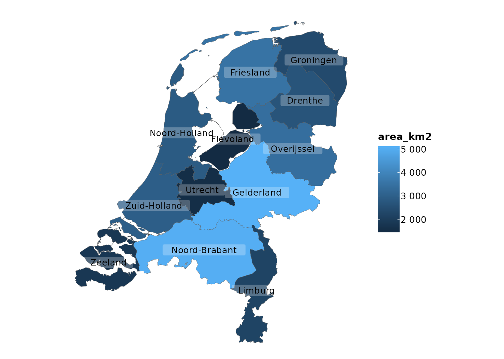

``` r

p |> 
  add_line(y = mean(hp), colour = "red", legend.value = "Average HP")
```


This adds a line at the mean horsepower. The `add_*()` functions
automatically correct for `category`, removing the need for
pre-processing steps to determine (in this case) the mean. A legend item
can also be added by just setting `legend.value`.

In `ggplot2`, this would typically require adding
[`geom_hline()`](https://ggplot2.tidyverse.org/reference/geom_abline.html)
with an aesthetic mapping.
[`plot2()`](https://msberends.github.io/plot2/reference/plot2.md)
simplifies this to a single function call.

#### Adding Points

Points can be added to highlight specific values or observations:

``` r
p |> 
  add_point(x = median(mpg), y = median(hp), shape = 4, size = 10)
```

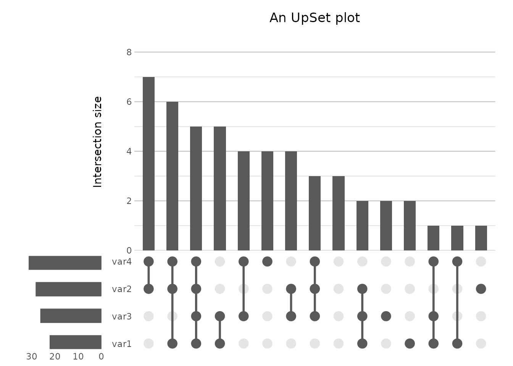

In this example, we add a point at the median `mpg` and `hp`, using a
cross shape and a larger size for emphasis. This mirrors
[`geom_point()`](https://ggplot2.tidyverse.org/reference/geom_point.html)
in `ggplot2` but is more tightly integrated with
[`plot2()`](https://msberends.github.io/plot2/reference/plot2.md)’s
streamlined interface.

#### Adding Columns

Adding columns is just as straightforward, and can be used to create bar
charts or other similar visualisations:

``` r
p |> 
  add_col(x = cyl, y = n(), width = 0.5)
```

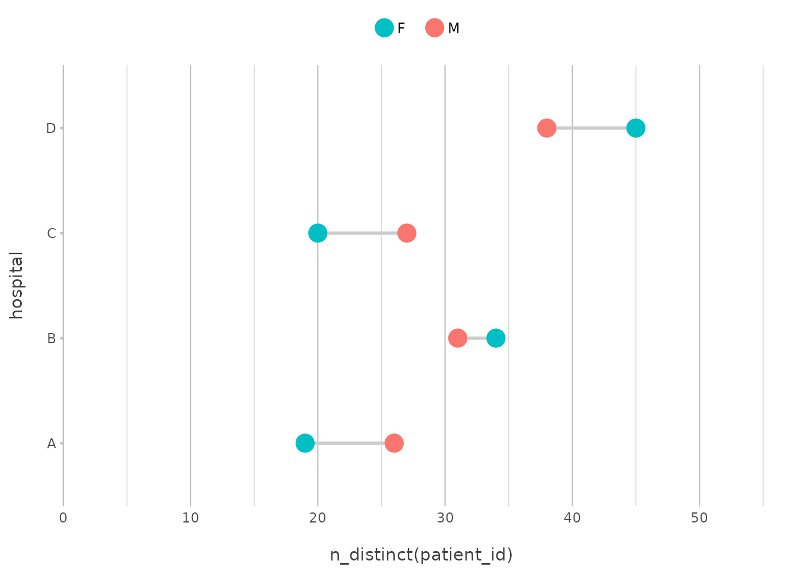

Here, we add columns based on the number of cylinders, making it easy to
compare the counts across different groups. This replaces
[`geom_col()`](https://ggplot2.tidyverse.org/reference/geom_bar.html) or
`geom_bar(stat = "identity")` in `ggplot2`, maintaining simplicity and
directness.

#### Plotting Error Bars

Plotting error bars is just as simple:

``` r
p |> 
  add_errorbar(min = hp - 10, max = hp + 10)
```


This adds error bars to the plot, showing a range of ±10 around the `hp`
values.
[`plot2()`](https://msberends.github.io/plot2/reference/plot2.md)
abstracts away the complexities of
[`geom_errorbar()`](https://ggplot2.tidyverse.org/reference/geom_linerange.html),
offering a more intuitive syntax.

#### Adding Spatial Features with `add_sf()`

For those working with geographic data,
[`add_sf()`](https://msberends.github.io/plot2/reference/add_type.md)
makes it easy to integrate spatial features:

``` r
plot2(netherlands) |> 
  add_sf(netherlands, colour_fill = NA, colour = "red", linewidth = 2)
#> ℹ Assuming datalabels.centroid = TRUE. Set to FALSE for a point-on-surface
#> placing of datalabels.
#> ℹ Using category = area_km2
#> ℹ Using datalabels = province
```

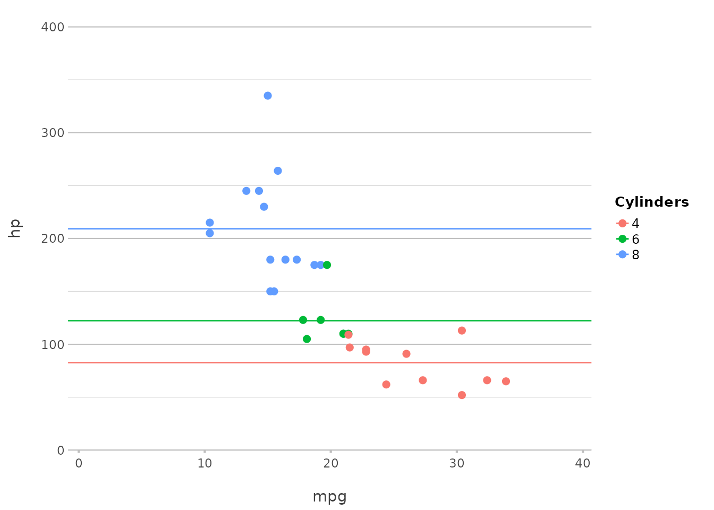

This example adds spatial features to a plot of the Netherlands, with an
extra border around the provinces. `ggplot2` users would typically use
[`geom_sf()`](https://ggplot2.tidyverse.org/reference/ggsf.html) for
this purpose, but
[`plot2()`](https://msberends.github.io/plot2/reference/plot2.md)
integrates this directly, making geographic plotting more accessible.

### Customising Fonts in `plot2()`

Another powerful feature of
[`plot2()`](https://msberends.github.io/plot2/reference/plot2.md) is its
flexibility with fonts. Whether you’re aiming for a professional look,
something playful, or anything in between,
[`plot2()`](https://msberends.github.io/plot2/reference/plot2.md) allows
you to easily customise fonts to suit your needs.

#### Using System Fonts and Google Fonts

[`plot2()`](https://msberends.github.io/plot2/reference/plot2.md)
supports all installed system fonts, as well as over 1,400 Google Fonts,
giving you an extensive range of choices for your plots. Missing fonts
will be downloaded automatically, and the required DPI will be set for
you, even in R Markdown outputs.

Here’s how you can apply a custom font from Google Fonts, which will be
downloaded automatically:

``` r
mtcars |> 
  plot2(mpg, hp, wt * 1000,
        facet = ifelse(vs == 0, "V-shaped Engine", "Straight Engine"),
        font = "Rock Salt",
        title = "Custom Font Example", 
        x.title = "Miles per US gallon",
        y.title = "Gross Horsepower",
        category.title = "Weight (lbs)",
        facet.fixed_y = TRUE)
#> ℹ Assuming facet.fixed_x = TRUE since the two x scales differ by less than 25%
#> ℹ Assuming facet.repeat_lbls_y = FALSE since y has fixed scales
#> ℹ Using type = "point" since both axes are numeric
```


In this example, the `Rock Salt` font, a playful and hand-drawn style,
is applied across the plot.

In `ggplot2`, using custom fonts often requires extra handling using the
`showtext` package with manual adjustments in theme settings.
[`plot2()`](https://msberends.github.io/plot2/reference/plot2.md)
simplifies this by integrating `showtext` into its core, including
automatic downloading and font scaling.

#### Creating Consistent Themes with Fonts

By setting font options globally through R options, you can maintain
consistent styling across multiple plots. This is particularly useful
when preparing a series of visualisations for a report or presentation.

``` r
options(plot2.font = "Lobster")
options(plot2.colour = "viridis")

mtcars |> 
  plot2(mpg, hp, title = "Consistent Font Example",
        text_factor = 1.5)
#> ℹ Using type = "point" since both axes are numeric
```


In this example, all plots will now use the `Lobster` font, ensuring a
consistent appearance across your visualisations. The `text_factor`
argument shows that it can be used to scale the text size of all plot
elements, ensuring readability and aesthetic balance.

``` r
# reset again
options(plot2.font = NULL, plot2.colour = NULL)
```

Customising fonts in
[`plot2()`](https://msberends.github.io/plot2/reference/plot2.md) is
both flexible and straightforward, allowing you to tailor the typography
of your plots to match your project’s style. Whether you’re using a
system font or one of the many Google Fonts,
[`plot2()`](https://msberends.github.io/plot2/reference/plot2.md) makes
it easy to create visually appealing and consistent plots with minimal
effort.

## Discussion

[`plot2()`](https://msberends.github.io/plot2/reference/plot2.md) is
more than just a wrapper for `ggplot2`; it embodies a philosophy of
simplifying and streamlining the plotting process while building on the
robust foundation that `ggplot2` provides. If you’re familiar with
`ggplot2`, you know that its explicit, detailed approach to plot
creation is one of its greatest strengths, allowing for unparalleled
control over every aspect of a visualisation. However, with that power
comes the need for repetitive coding and a certain level of complexity
that can be challenging, especially for beginners.

#### Enhancing Workflow Efficiency

The primary goal of
[`plot2()`](https://msberends.github.io/plot2/reference/plot2.md) is to
make data visualisation faster and more intuitive by automating many of
the routine tasks involved in creating plots. Whether you’re working
with simple data or complex datasets requiring advanced transformations,
[`plot2()`](https://msberends.github.io/plot2/reference/plot2.md) helps
you get to the final visualisation with fewer lines of code and less
cognitive load. This not only speeds up your workflow but also makes
your code more readable and maintainable.

For instance, the ability to perform in-line transformations directly
within the plotting function eliminates the need for pre-processing
steps that would otherwise require additional code blocks using, e.g.,
`dplyr` or `tidyr`. This feature of
[`plot2()`](https://msberends.github.io/plot2/reference/plot2.md) alone
can drastically reduce the complexity of your code, especially when
working with large and multifaceted datasets.

#### A Natural Extension of `ggplot2`

`ggplot2` has established itself as a cornerstone of data visualisation
in R, and for good reason. Its layer-based approach and extensive
customisation options make it incredibly powerful.
[`plot2()`](https://msberends.github.io/plot2/reference/plot2.md) is
designed to complement these strengths by offering a more streamlined
interface that automates many of the common tasks in `ggplot2`. Think of
[`plot2()`](https://msberends.github.io/plot2/reference/plot2.md) as a
natural extension of `ggplot2` — one that retains the underlying power
while simplifying the process, especially for users who prefer a more
direct path from data to visualisation.

The `add_*()` functions exemplify this philosophy by allowing users to
add layers and elements with minimal code, maintaining the flexibility
of `ggplot2` while reducing the need for repetitive boilerplate. This
makes it easier to experiment with different visualisations and iterate
quickly on your designs.

#### Flexibility Without Complexity

One of the key advantages of
[`plot2()`](https://msberends.github.io/plot2/reference/plot2.md) is
that it retains the flexibility of `ggplot2` while reducing the need for
detailed specification. The automatic handling of plot types, axis
settings, and scales means that you can create sophisticated plots with
minimal input. Yet, when you need to take control,
[`plot2()`](https://msberends.github.io/plot2/reference/plot2.md) offers
all the options you would expect, from custom sorting to precise colour
control and font selection.

This balance between flexibility and simplicity is what makes
[`plot2()`](https://msberends.github.io/plot2/reference/plot2.md) a
powerful tool for both beginners and experienced users. Beginners can
quickly produce high-quality plots without getting bogged down in the
details, while advanced users can still leverage the full power of
`ggplot2` when necessary.

#### Philosophical Underpinnings

At the heart of
[`plot2()`](https://msberends.github.io/plot2/reference/plot2.md) is a
commitment to making data visualisation more accessible and less
intimidating. The goal is to lower the barriers to entry for creating
professional-quality plots, thereby empowering more people to engage
with data in a meaningful way. This aligns with the broader trend in the
R community and the tidyverse towards creating tools that are both
powerful and easy to use.

[`plot2()`](https://msberends.github.io/plot2/reference/plot2.md) is
also designed with the understanding that not every user needs — or
wants — to be an expert in the intricacies of `ggplot2`. By providing
sensible defaults and automating common tasks,
[`plot2()`](https://msberends.github.io/plot2/reference/plot2.md) allows
users to focus on the most important part of the visualisation process:
interpreting and communicating their data.

#### Reflecting on Usage Scenarios

The real value of
[`plot2()`](https://msberends.github.io/plot2/reference/plot2.md)
becomes evident in real-world usage scenarios. Whether you’re creating a
quick exploratory plot or preparing a polished visualisation for
publication,
[`plot2()`](https://msberends.github.io/plot2/reference/plot2.md) adapts
to your needs. Its versatility makes it suitable for a wide range of
applications, from routine data analysis to sophisticated data
storytelling.

Moreover,
[`plot2()`](https://msberends.github.io/plot2/reference/plot2.md)
integrates seamlessly with the broader tidyverse ecosystem. It works
effortlessly with other tidyverse packages, allowing you to incorporate
it into your existing workflows without disruption. This ensures that
you can continue to use the tools you’re familiar with while benefiting
from the efficiencies that
[`plot2()`](https://msberends.github.io/plot2/reference/plot2.md)
brings.

#### Looking Forward

As the R community continues to evolve, so too will the tools we use for
data visualisation.
[`plot2()`](https://msberends.github.io/plot2/reference/plot2.md)
represents a step towards a more user-friendly and efficient future,
where the focus is on insights and communication rather than technical
details. It’s a tool that grows with you — whether you’re just starting
out or pushing the boundaries of what’s possible with data
visualisation.

In the end, the success of any tool is measured by how well it meets the
needs of its users.
[`plot2()`](https://msberends.github.io/plot2/reference/plot2.md) has
been designed with a deep understanding of the challenges and
frustrations that come with creating complex plots in R. By addressing
these challenges head-on,
[`plot2()`](https://msberends.github.io/plot2/reference/plot2.md) aims
to make your data visualisation journey smoother, more enjoyable, and
ultimately more productive.
