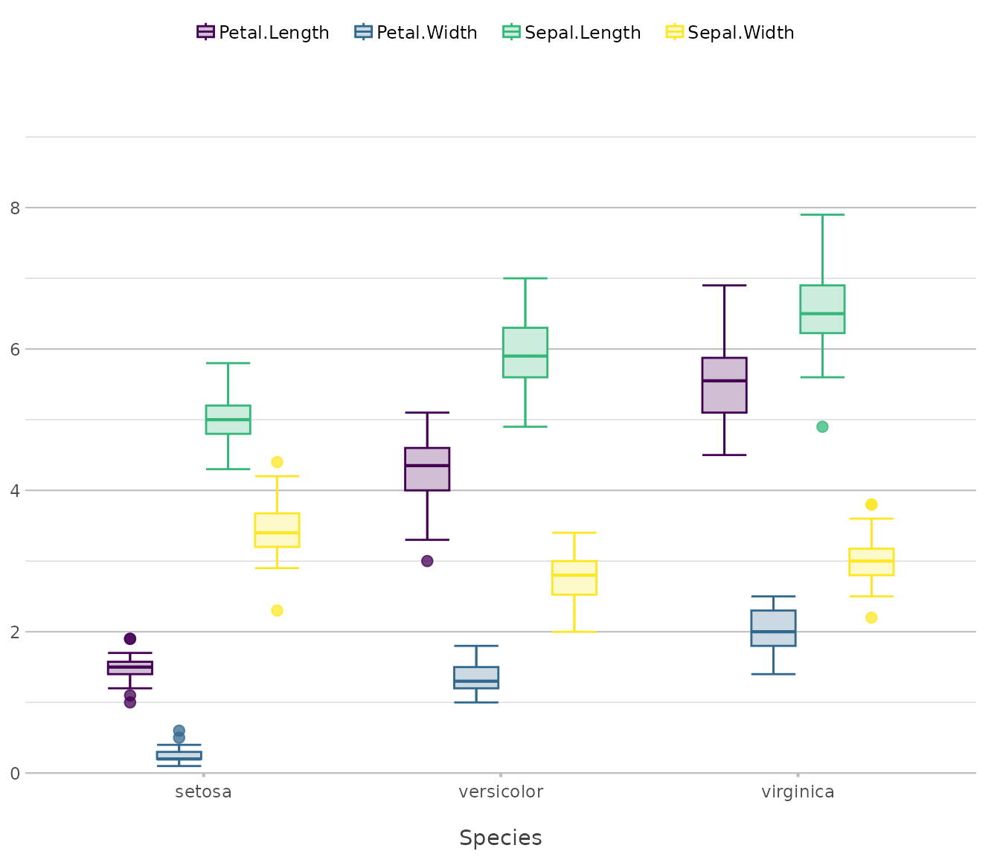
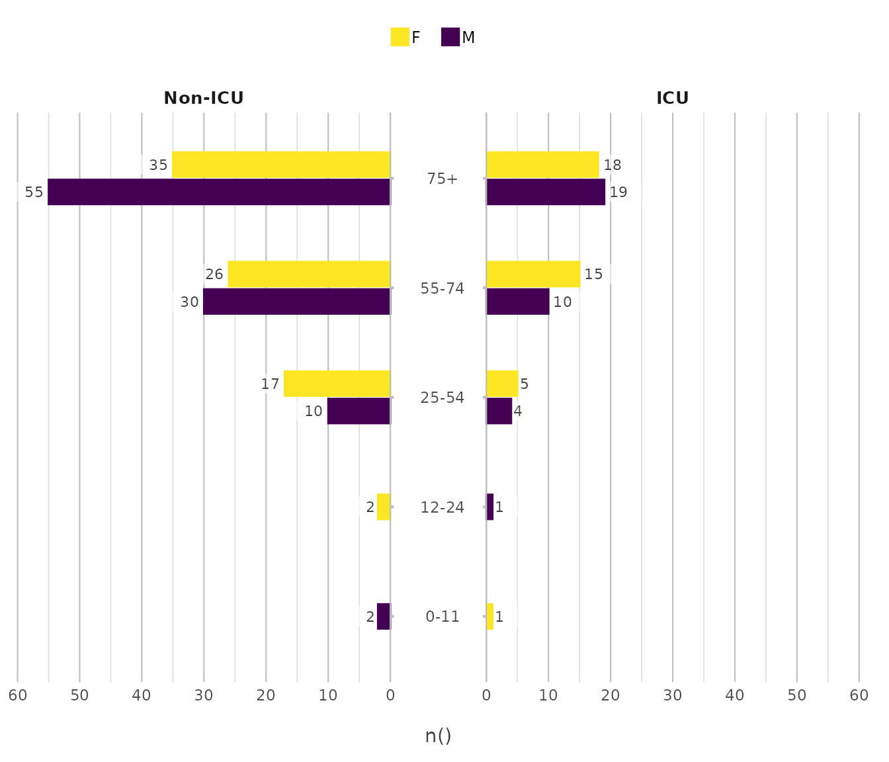
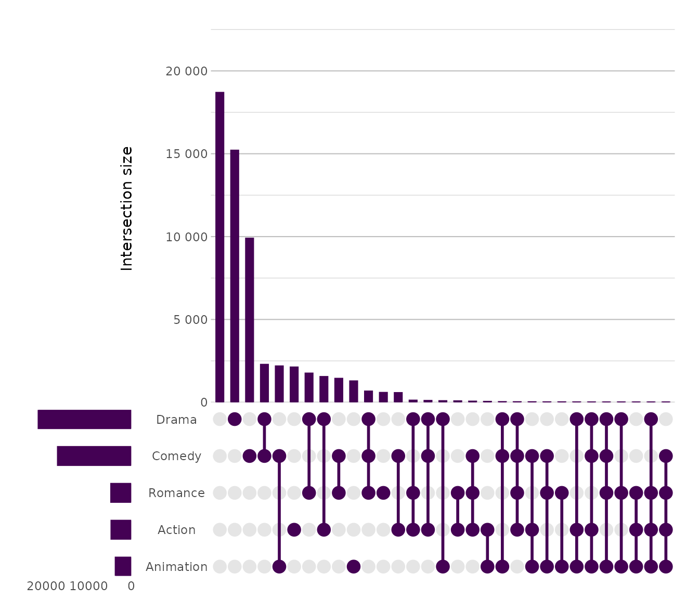

# Supported Plot Types

The following plot types are supported.

Any `ggplot2` geom is supported, but we added support for some other,
more advanced plots.

## Column / Bar

Used for comparing discrete categories through rectangular bars.

``` r
diamonds |> # from the ggplot2 package
  plot2(x = cut,
        y = n())
```


In `plot2`, bar types are horizontal alternatives for column types (just
like MS Excel):

``` r
diamonds |>
  plot2(x = cut,
        y = n(),
        type = "bar")
```


## Line

Used for visualising trends over ordered intervals.

``` r
pressure |> # from base R
    plot2(x = temperature,
          y = pressure,
          type = "line")
```


``` r
pressure |>
    plot2(x = temperature,
          y = pressure,
          type = "line-point")
```


## Point

Used for displaying individual observations in a two dimensional space.

``` r
iris |> # from base R
  plot2()
#> ℹ Using category = Species
#> ℹ Using type = "point" since both axes are numeric
#> ℹ Using x = Sepal.Length
#> ℹ Using y = Sepal.Width
```


``` r
diamonds |>
  plot2(x = carat,
        y = price,
        category = cut,
        type = "point")
```


## Area

Used for emphasising cumulative magnitudes across continuous domains.

``` r
pressure |>
    plot2(x = temperature,
          y = pressure,
          type = "area")
```


``` r
airquality |>
  plot2(x = Day, 
        y = Wind, 
        category = Month,
        category.character = TRUE,
        stacked_fill= TRUE,
        type = "area")
```


## Boxplot / Violin

Used for summarising and comparing distributions with focus on spread
and density.

``` r
iris |>
  plot2(x = Species,
        type = "violin")
#> ℹ Using y = Sepal.Length
```


``` r
iris |>
  plot2(x = Species,
        y = where(is.double),
        type = "boxplot")
#> ℹ Using y = c(Petal.Length, Petal.Width, Sepal.Length, Sepal.Width)
```



## Histogram

Used for visualising the frequency distribution of continuous variables.

``` r
diamonds |>
  plot2(x = price,
        type = "hist")
#> ℹ Assuming smooth = TRUE for type = "histogram"
#> ℹ Using binwidth = 841 based on data
#> ✖ Values set in x.limits are of class numeric, while the values on x are of
#> class integer
```


## Geo (sf)

Used for mapping spatial data encoded as simple features.

``` r
netherlands |> # from this plot2 package
  plot2()
#> ℹ Assuming datalabels.centroid = TRUE. Set to FALSE for a point-on-surface
#> placing of datalabels.
#> ℹ Using category = area_km2
#> ℹ Using datalabels = province
```


## Beeswarm

Used for showing distributions of individual observations without
overlap.

``` r
iris |>
  plot2(x = Species,
        y = Sepal.Length,
        type = "beeswarm")
```


## Back-to-back

Used for contrasting two mirrored groups across shared categories.

``` r
admitted_patients |> # from this plot2 package
    plot2(x = age_group,
          y = n(),
          facet = ward,
          type = "back-to-back")
```


``` r
admitted_patients |> # from this plot2 package
    plot2(x = age_group,
          y = n(),
          y.limits = c(0, 60),
          category = gender,
          facet = ward,
          type = "back-to-back")
```



## Dumbbell

Used for highlighting changes or differences between paired values.

``` r
diamonds |>
  dplyr::filter(cut %in% c("Fair", "Very Good")) |>
  plot2(x = cut(carat, 6),
        y = median(price),
        category = cut,
        type = "dumbbell")
```


## Sankey

Used for depicting flows or transitions between connected stages.

``` r
Titanic |> # from base R
  plot2(x = c(Age, Class, Survived),
        category = Sex,
        type = "sankey")
#> ℹ Assuming sankey.remove_axes = TRUE
#> ! Input class 'table' was transformed using `as.data.frame()`
```


## UpSet

Used for analysing intersections among multiple sets with scalable
clarity.

``` r
movies |> # from the ggplot2movies package
  plot2(x = c(Action, Animation, Comedy, Drama, Romance),
        type = "upset")
#> ℹ Using summarise_function = sum for UpSet plot
#> ℹ Using y = 1
```



``` r
movies |>
  plot2(x = c(Action, Animation, Comedy, Drama, Romance),
        y = median(rating),
        y.title = "Median Rating",
        x.sort = TRUE,
        type = "upset")
#> ℹ Using summarise_function = sum for UpSet plot
```


