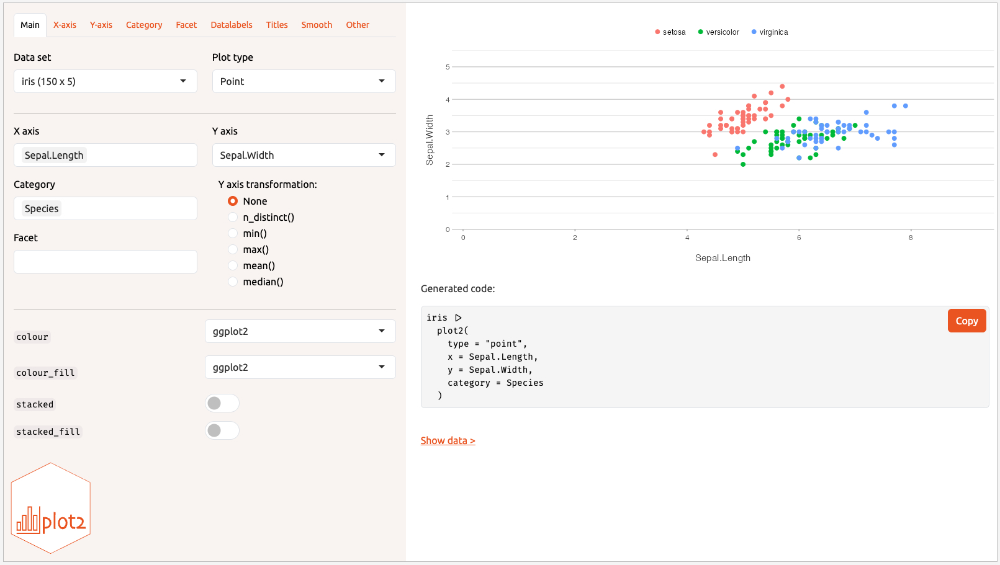

# Interactively Create a `plot2`

This Shiny app allows for interactive creation of a `plot2`.

## Usage

``` r
create_interactively(
  data = NULL,
  css_code = NULL,
  logo_path = system.file("logo.svg", package = "plot2"),
  pretty_labels = FALSE,
  hide_generated_code = FALSE,
  hide_export_buttons = TRUE
)
```

## Arguments

- data:

  A data set to load. Not strictly required, since all data sets in the
  global environment will be shown.

- css_code:

  Additional CSS code to load in the app.

- logo_path:

  Path to the logo shown in the app. Default to the `plot2` logo. Use
  `NULL` to not use a logo.

- pretty_labels:

  A logical to switch to pretty, readable labels, instead of argument
  names in code style.

- hide_generated_code:

  A logical to hide generated code.

- hide_export_buttons:

  A logical to hide export buttons and functionality.

## Details



## Examples

``` r
if (FALSE) { # \dontrun{

create_interactively()

iris |> create_interactively()
} # }
```
