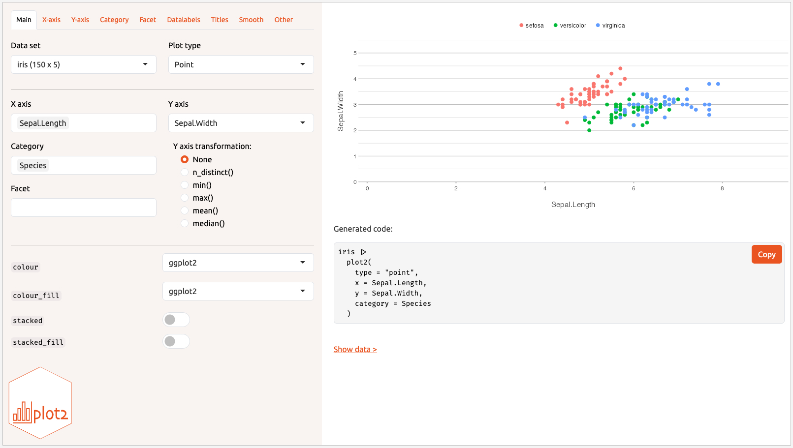

# Interactively Create a `plot2`

This Shiny app allows for interactive creation of a `plot2`.

## Usage

``` r
create_interactively(
  data = NULL,
  css_code = NULL,
  logo_path = system.file("logo.svg", package = "plot2"),
  pretty_labels = FALSE,
  hide_generated_code = FALSE,
  hide_export_buttons = NULL,
  upload_tab = FALSE
)
```

## Arguments

- data:

  A data set to load. Not strictly required, since all data sets in the
  global environment will be shown.

- css_code:

  Additional CSS code to load in the app.

- logo_path:

  Path to the logo shown in the app. Default to the `plot2` logo. Use
  `NULL` to not use a logo.

- pretty_labels:

  A logical to switch to pretty, readable labels, instead of argument
  names in code style.

- hide_generated_code:

  A logical to hide generated code.

- hide_export_buttons:

  A logical to hide export buttons and functionality. `TRUE` will hide
  the elements completely, `NULL` will show a clickable text to expand
  buttons (default), `FALSE` will show the expanded buttons.

- upload_tab:

  A logical to show a dedicated **Upload** tab in the sidebar. When
  `TRUE`, a full-featured data-import tab is added with format-specific
  options for many file types (CSV, TSV, Excel, SPSS, Stata, SAS, RDS,
  JSON, Parquet, Feather, YAML, XML, and more). The "Upload data set..."
  dropdown item will redirect to this tab instead of opening a modal.
  Requires the `readxl` package in addition to the packages checked for
  `upload_tab = FALSE`. Administrators can ensure all dependencies are
  present by running `plot2:::install_shiny_deps()` before launching the
  app.

## Details



## Examples

``` r
if (FALSE) { # \dontrun{

create_interactively()

iris |> create_interactively()

# With the upload tab for importing external data files:
create_interactively(upload_tab = TRUE)
} # }
```
